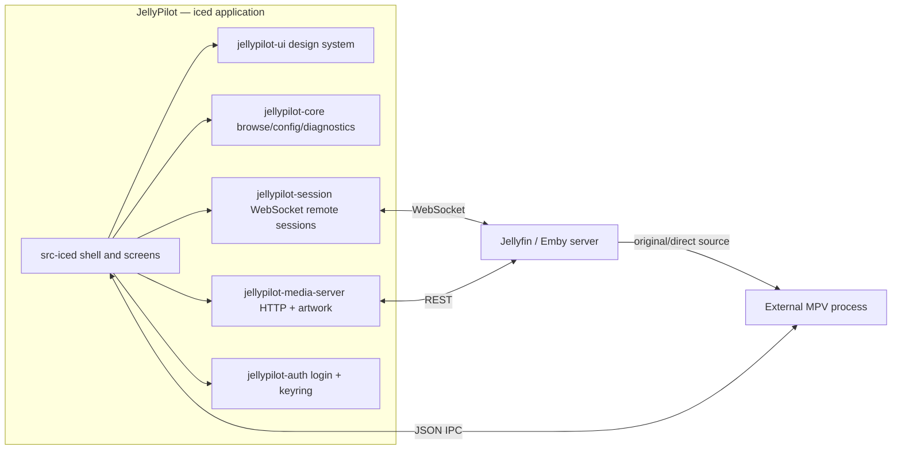

<div align="center">


# JellyPilot

[](https://github.com/hewel/jellypilot/actions/workflows/ci.yml)
[](https://www.rust-lang.org/)
[](https://iced.rs/)
[](LICENSE)
[](https://aur.archlinux.org/packages/jellypilot)

**A Jellyfin and Emby companion app: controllable cast receiver and video Library Browser that plays through your own MPV.**

Built with Rust and [iced](https://iced.rs/) — fully custom-drawn, cross-platform, no webview.

</div>

---

## 📖 Overview

JellyPilot signs in to Jellyfin or Emby, browses your video libraries, and presents media through **External MPV Playback**: a standalone MPV process driven over JSON IPC, so your MPV configuration, shaders, and scripts stay in charge. JellyPilot never embeds `libmpv` and never requests a Provider Transcode — MPV plays the original or direct source. For Jellyfin, JellyPilot also registers as a cast target other Jellyfin clients can play to.

## ✨ Features

| Feature                       | Description                                                                                  |
| :---------------------------- | :------------------------------------------------------------------------------------------- |
| 🎞️ **Jellyfin + Emby**        | Connect to Jellyfin or Emby servers with saved service profiles                              |
| 📚 **Library Browser**        | Browse Movies and Shows, open item details, and start playback                               |
| 📺 **Jellyfin Cast Target**   | Appears as a controllable device in Jellyfin's cast menu                                     |
| 🚀 **External MPV Playback**  | Standalone MPV process over JSON IPC; your configuration, shaders, and scripts apply         |
| 🔒 **Persistent Auth**        | Login once, stay connected; access tokens live in the OS keychain                            |
| 🔑 **Jellyfin Quick Connect** | Authenticate by approving a one-time code on another device                                  |
| 🔄 **Auto-Reconnect**         | Resilient WebSocket connection with exponential backoff                                      |
| ⏭️ **Smart Playback**         | Automatic next episode and episode navigation from the player bar or tray                    |
| ✂️ **Intro Skipper**          | Skips Jellyfin Intro Skipper plugin intro and credit ranges during playback                  |
| 🧠 **Series Memory**          | Remembers per-series audio/subtitle track preferences                                        |
| ⌨️ **Shortcuts**              | Configurable shortcuts (`Shift+>` / `Shift+<` by default) to skip episodes                   |
| 🖥️ **System Tray**            | Background operation with transport controls, show window, and quit                          |
| 🍏 **Cross-Platform**         | Native support for Windows, macOS, and Linux from one custom-drawn codebase                  |

## 🧩 Server Support

| Server       | Supported | Notes                                                                                                                                          |
| :----------- | :-------- | :--------------------------------------------------------------------------------------------------------------------------------------------- |
| **Jellyfin** | ✅        | Password login, Quick Connect, saved profiles, library browsing, MPV playback, cast target registration, remote control, Intro Skipper support |
| **Emby**     | ✅        | Password login, saved profiles, library browsing, MPV playback, remote control, and playback progress reporting                                |

Emby support uses the same library and player workflow as Jellyfin where the server APIs are compatible. Jellyfin-specific features such as Quick Connect and the Jellyfin Intro Skipper plugin are not advertised for Emby connections.

## 🗺️ Roadmap

- [x] **[Quick Connect](https://jellyfin.org/docs/general/server/quick-connect/)** — login via code from another device
- [x] **[Intro Skipper](https://github.com/intro-skipper/intro-skipper) integration** — auto-skip intros/credits
- [x] **Cross-platform iced frontend** — one custom-drawn native UI for Windows, macOS, and Linux ([ADR 0027](docs/adr/0027-cross-platform-iced-frontend.md))
- [ ] **Light theme** — system-following light/dark palettes
- [ ] **Control-only mode** — a lightweight Now Playing + Settings surface without the Library Browser
- [ ] **MPRIS support** — Linux media player integration for desktop controls

## 🚀 Quick Start

### Runtime prerequisites

- [MPV](https://mpv.io/) available on `PATH` — it is the only playback engine.

### Installation

#### Arch Linux (AUR)

Install from the [AUR](https://aur.archlinux.org/packages/jellypilot) with any AUR helper:

```bash
yay -S jellypilot
# or
paru -S jellypilot
```

#### Build from Source

<details>
<summary>Development prerequisites</summary>

- [Rust](https://rustup.rs/) 1.88 or newer
- [Bun](https://bun.sh/) 1.3.14 or newer (task dispatcher only — there is no JavaScript frontend)
- Linux: `libxkbcommon` and Wayland development packages

</details>

```bash
git clone https://github.com/hewel/jellypilot.git
cd jellypilot
bun install --frozen-lockfile
bun run task iced run --release
```

The release binary is `target/release/jellypilot`.

### Usage

1. **Launch JellyPilot** from your application menu or terminal.
2. **Choose a server type**: Jellyfin or Emby on the login screen.
3. **Authenticate** with your Server URL and credentials; Jellyfin also supports Quick Connect.
4. **Browse or cast**: start playback from JellyPilot's Library Browser, or cast to "JellyPilot" from another Jellyfin client.
5. **Control playback** from the player bar, the system tray, or another Jellyfin client.

## 🏗️ Architecture

One Rust workspace; every crate below the app is display-free and test-covered.



- `src-iced` — the application: shell, screens, tray, subscriptions, orchestration.
- `crates/jellypilot-ui` — the design system: tokens, theme/Catalog styles, custom widgets, overlay.
- `crates/jellypilot-core` — display-free browse model, configuration, request gate, diagnostics, artwork load planning.
- `crates/jellypilot-media-server` — Jellyfin/Emby HTTP adapter over the generated OpenAPI clients in `crates/media-server-api/`.
- `crates/jellypilot-auth` — login workflows and OS keychain token storage.
- `crates/jellypilot-mpv` — MPV process lifecycle and JSON IPC protocol.
- `crates/jellypilot-session` — media-server WebSocket remote-control sessions.

## 💻 Development

### Commands

| Task                    | Command                                |
| :---------------------- | :------------------------------------- |
| **Run the app**         | `bun run task iced run`                |
| **Startup smoke gate**  | `xvfb-run -a bun run task iced run --smoke` |
| **Check everything**    | `bun run check`                        |
| **Rust tests**          | `bun run task rust test`               |
| **Rust clippy**         | `bun run task rust clippy`             |
| **Regenerate API clients** | `bun run task api`                  |

### Conventions

- **Rust**: 2-space indent (`rustfmt.toml`); `unsafe_code` forbidden workspace-wide; clippy warnings are errors.
- **Display-free logic** lives in `jellypilot-core` and is tested there; `src-iced` keeps orchestration and views.
- **Domain language**: [CONTEXT.md](CONTEXT.md) is the glossary; [docs/adr/](docs/adr/) records architecture decisions.

## 📜 Release Notes

Earlier releases (≤ 1.4.x) shipped a Tauri/Solid.js frontend with an embedded web player and local FFmpeg HLS pipeline. That stack was retired per [ADR 0027](docs/adr/0027-cross-platform-iced-frontend.md): the iced application always presents External MPV Playback, and settings/saved profiles start fresh — no Tauri Store data is imported.

## 🙏 Credits

- [MPV](https://mpv.io/) — the best media player in existence.
- [iced](https://iced.rs/) — the cross-platform GUI library this app is drawn with.
- [Jellyfin](https://jellyfin.org/) and [Emby](https://emby.media/) — the media servers JellyPilot companions.
