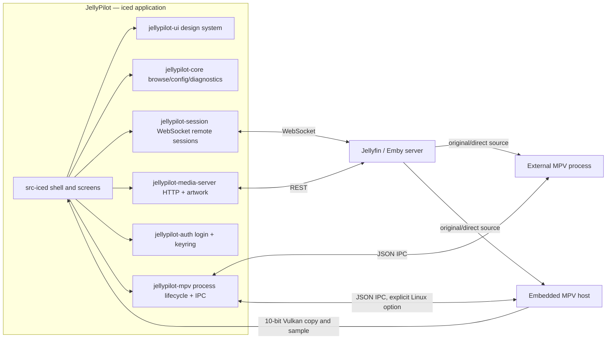

<div align="center">


# JellyPilot

[](https://github.com/hewel/jellypilot/actions/workflows/ci.yml)
[](https://www.rust-lang.org/)
[](https://iced.rs/)
[](LICENSE)

**A native Jellyfin and Emby companion: library browser, cast receiver, and playback controller — using your own external MPV by default.**

Custom-drawn with Rust and [iced](https://iced.rs/). Cross-platform. No webview or forced transcoding. Optional Linux Vulkan SDR playback inside the app.

</div>

---

## 📖 Overview

JellyPilot signs in to Jellyfin or Emby, browses your video libraries, and defaults to **External MPV Playback**: a standalone MPV process controlled over JSON IPC. Your MPV configuration, shaders, and scripts stay in charge. **Embedded MPV Playback** is an explicit Linux Vulkan SDR option with a separate application-owned baseline; it does not load your external MPV configuration.

Jellyfin clients can discover JellyPilot as a cast target. Both Jellyfin and Emby sessions can mirror supported remote transport commands to the app, the player bar, and the system tray.

## 🖼️ Screenshots

### Full library and playback

<a href="assets/screenshots/Screenshot%20from%202026-09-06%2023-48-49.png">
  
</a>

<p align="center"><sub>Dark theme · Home and playback controls</sub></p>

### Library browsing

<a href="assets/screenshots/Screenshot%20from%202026-09-06%2023-49-02.png">
  
</a>

<p align="center"><sub>Dark theme · Series library and filters</sub></p>

### Control-Only mode

<p align="center">
  <a href="assets/screenshots/Screenshot%20from%202026-09-02%2017-31-01.png">
    
  </a>
</p>

<p align="center"><sub>Control-Only mode · Queue, tracks, transport, and volume</sub></p>

## ✨ Features

| Feature                       | Description                                                                                          |
| :---------------------------- | :--------------------------------------------------------------------------------------------------- |
| 🎞️ **Jellyfin + Emby**        | Connect to Jellyfin or Emby servers with saved service profiles                                      |
| 📚 **Library Browser**        | Movies, shows, and search with persisted filters, virtualized grids, and disk-cached artwork         |
| ⭐ **User Data Actions**     | Favorite or unfavorite items and mark them played or unplayed directly from item details             |
| 📺 **Jellyfin Cast Target**   | Appears as a controllable device in Jellyfin's cast menu                                             |
| 🚀 **External MPV Playback**  | Standalone MPV over JSON IPC; your configuration, shaders, and scripts apply to the original source  |
| 📑 **Episode Queue**          | Current-season episode list in the player bar and compact player — click any episode to switch       |
| 💬 **External Subtitles**     | Server-hosted external subtitle tracks loaded into MPV, with the default selection applied           |
| ✂️ **Intro Skipper**          | Skips Jellyfin native intro and credit ranges, including multiple ranges of the same type             |
| 🌐 **Subtitle Preferences**  | Configurable preferred subtitle languages passed directly to MPV                                    |
| ⏭️ **Smart Playback**         | Automatic next episode on natural end, plus episode navigation from the player bar or tray           |
| 🎛️ **Control-Only Mode**      | A compact always-on-top-style controller window without the library shell                            |
| 🌗 **Light + Dark Themes**    | System-following palettes from one design-token set                                                  |
| 🔒 **Persistent Auth**        | Login once, stay connected; access tokens live in the OS keychain                                    |
| 🔑 **Jellyfin Quick Connect** | Authenticate by approving a one-time code on another device                                          |
| 🔄 **Auto-Reconnect**         | Resilient WebSocket connection with exponential backoff                                              |
| ⌨️ **Shortcuts**              | Configurable shortcuts: `Shift+>` / `Shift+<` for episodes and `g` for intro skipping by default     |
| 🖥️ **System Tray**            | Background operation with transport controls, show window, and quit                                  |
| 🍏 **Cross-Platform**         | Native support for Windows, macOS, and Linux from one custom-drawn codebase                          |

## 🧩 Server Support

| Server       | Supported | Notes                                                                                                                                          |
| :----------- | :-------- | :--------------------------------------------------------------------------------------------------------------------------------------------- |
| **Jellyfin** | ✅        | Password login, Quick Connect, saved profiles, library browsing, user data actions, MPV playback, cast target registration, remote control, Intro Skipper support |
| **Emby**     | ✅        | Password login, saved profiles, library browsing, user data actions, MPV playback, remote control, and playback progress reporting                                |

Emby support uses the same library and player workflow as Jellyfin where the server APIs are compatible. Jellyfin-specific features such as Quick Connect and Intro Skipper are not advertised for Emby connections.

Jellyfin 12.0 does not require legacy authorization to be enabled: JellyPilot uses the standard
`Authorization` header for API requests and `ApiKey` for playback, subtitles, and remote sessions.
Enter the server's actual base URL, including any configured reverse-proxy base path; Jellyfin 12
removed the automatic `/emby` and `/mediabrowser` route aliases.

Intro Skipper reads Jellyfin's native media segments, including ranges published by the Intro Skipper
plugin or another server provider. Automatic, Manual, and Off still apply to intro/credit ranges only;
each range is handled independently. The deprecated plugin endpoint is no longer used. If no native
ranges are available, playback continues without skipping; ensure the server's segment extraction or
plugin synchronization has populated them.

## 🗺️ Roadmap

- [ ] **MPRIS support** — Linux desktop media-player integration for keys and widgets

## 🚀 Quick Start

### Runtime prerequisites

- External playback: [MPV](https://mpv.io/) with Lua scripting support, available on `PATH` or selected explicitly in Settings. A bundled Lua hook captures volume and temporary mute before MPV resets file-local options at the end of playback.
- Embedded playback: the exact host-enabled libmpv build and baseline below, plus Linux Vulkan with a supported `Rgb10a2Unorm` presentation surface. Missing capability is an error, not an eight-bit, software, system-libmpv, or external-player fallback.

### Installation

#### Arch Linux

Until `jellypilot-bin` is published to the AUR, download the native
`jellypilot-2.0.0-1-x86_64.pkg.tar.zst` asset from the
[v2.0.0 release](https://github.com/hewel/jellypilot/releases/tag/v2.0.0) and install it directly:

```bash
sudo pacman -U ./jellypilot-2.0.0-1-x86_64.pkg.tar.zst
```

#### Build from Source

<details>
<summary>Development prerequisites</summary>

- [Rust](https://rustup.rs/) 1.98 or newer
- [Bun](https://bun.sh/) 1.3.14 or newer (task dispatcher only — there is no JavaScript frontend)
- Linux: GTK 3, `libxkbcommon`, and Wayland development packages

</details>

```bash
git clone https://github.com/hewel/jellypilot.git
cd jellypilot
bun install --frozen-lockfile
bun run task iced build --release
```

The release binary is `target/release/jellypilot`.

Maintained Cargo tasks prepare `target/vendor/iced` before building. Its exact base revision and
the checked-in extension patch SHA-256 are pinned in `tools/embedded-mpv/iced-source.json`;
the base checkout is verified and the patch is applied without modifying a sibling checkout.
An unavailable remote revision fails explicitly. Before the fork revisions are published,
supply an accessible checkout containing the exact pinned commit:

```bash
bun run task iced prepare --source /absolute/path/to/iced
```

### Embedded MPV: build, select, and recover

This accepted integration supersedes ADR 0027's external-only playback restriction, not its
native iced/no-webview decision. External remains the default, including existing settings
files. In **Settings → Playback**, select Embedded and restart; the same player, transport,
queue, volume, subtitles, and remote-session controller are reused. **Show video** opens the
player surface while browsing. Switching back preserves the external executable and arguments.

```bash
# Linux prerequisites: Meson >=1.3, Ninja, C/C++ compiler, pkg-config,
# Vulkan development headers/loader, FFmpeg, libplacebo >=7.360.1, libass.
bun run task mpv build --source /absolute/path/to/mpv
bun run task iced run --embedded
```

`tools/embedded-mpv/source.json` pins mpv to
`6430785cab693d103ea5a7b70de6efa92c5700d4`, its baseline, and Meson options.
The supplied source must be at that revision with no tracked changes. Without `--source`,
the task fetches that revision from the configured fork; an unpublished or inaccessible
revision is a hard prerequisite failure. No source commit or push is performed.

The build stages `target/embedded-mpv/lib/jellypilot/libmpv.so`,
`target/embedded-mpv/share/jellypilot/mpv-baseline.conf`, and `manifest.json`.
The manifest records source, configuration, tool/dependency versions and artifact hashes.
Source and options are pinned; host libraries/compiler and auto-selected dependencies are
recorded, **not pinned**, so this is not a bit-reproducible or self-contained distribution.
Vulkan headers may be supplied explicitly through `CFLAGS=-I/absolute/sdk/include` (and
dependencies through `PKG_CONFIG_PATH`); neither is silently obtained from another build tree.

For this workstation, the explicit SDK came from
`vulkan-headers-1:1.4.357.0-1-any.pkg.tar.zst`
(SHA-256 `2f6c34cc829c4b63c0cf08cf147841c8ded023b746324540fb02322d9c415c07`),
extracted under `target/sdk/vulkan-headers-1.4.357.0`. Its `usr/include` was passed in `CFLAGS`
to the build command; the staged library was rebuilt from the pinned mpv source.

Development run/hot commands pass staged asset paths even when Embedded is selected through
saved settings. Absolute `JELLYPILOT_LIBMPV` and `JELLYPILOT_MPV_BASELINE` overrides are
supported; only trusted files implementing the pinned host ABI may be loaded. A directly
launched binary instead looks beside itself for `lib/jellypilot/libmpv.so` and
`share/jellypilot/mpv-baseline.conf`. Existing native packages remain external-first and do
not silently bundle host system libraries. To recover from an unavailable embedded setup,
launch `jellypilot --external`, select External in Settings, and restart.

The host retains the actual enabled Vulkan feature chain and shares its device/queue with
the official iced renderer. Video reaches a private 10-bit texture through three ordered
command buffers: tracked `COPY_DST` transition, raw copy, tracked `RESOURCE` transition.
Queue submissions, acquisition/presentation/discard and image/screenshot submits share a
gate; device polling and synchronous mpv calls stay outside it. MPV owns playback time.
The private launcher contains only the two unsafe engine/surface handoffs; Vulkan/libmpv
FFI lives in `jellypilot-mpv-host`, while `src-iced` retains its unsafe-code prohibition.
This does not claim HDR, hardware decoding, zero-copy playback, or downstream compositor
presentation feedback. Non-Linux embedded startup is explicitly unavailable.
The daemon factory retains the host/device resources across last-window close; reopening
creates a new surface and renderer for the same playback session. Daemon exit terminates
mpv before removing its process-private IPC directory.

### Usage

1. **Launch JellyPilot** from your application menu or terminal.
2. **Choose a server type**: Jellyfin or Emby on the login screen.
3. **Authenticate** with your Server URL and credentials; Jellyfin also supports Quick Connect.
4. **Browse and manage your library**: open item details to update favorite or played state.
5. **Play or cast**: start playback directly in JellyPilot, or cast to "JellyPilot" from another Jellyfin client.
6. **Control playback** from the player bar, the system tray, or a supported Jellyfin/Emby remote session — open the episode queue to jump anywhere in the current season.
7. **Switch app modes** from Settings: Full library mode, or Control-Only — a compact standalone controller window.

**Season volume memory** is enabled by default under **Settings → Playback**. Player volume
adjustments are remembered per season on this device, separately for each server and account.
The next episode, a manually selected episode, or a later session restores that season's volume
before playback starts. Movies and episodes without a saved, reliably identified season use
MPV's startup volume instead. This remembers the player's volume, not system volume, and does
not normalize audio loudness.

Turning the switch off stops saving and restoring without deleting existing records or changing
the current volume. Turning it back on restores saved values on the next load. Temporary mute
is retained during continuous episode playback, but is not saved for a later playback session.

## 🏗️ Architecture

One Rust workspace: `jellypilot-ui` owns the custom iced presentation layer, while the domain and infrastructure crates remain display-free and test-covered.



- `src-iced` — the application: shell, screens, tray, subscriptions, orchestration.
- `crates/jellypilot-launcher` — executable-only entry point and private unsafe engine/surface handoffs.
- `crates/jellypilot-mpv-host` — Linux host ABI, retained Vulkan device/features, bounded producer images and GPU copy lifecycle.
- `crates/jellypilot-ui` — the design system: tokens, theme/Catalog styles, custom widgets, overlay.
- `crates/jellypilot-core` — display-free browse model, configuration, request gate, diagnostics, artwork load planning.
- `crates/jellypilot-media-server` — Jellyfin/Emby HTTP adapter over the generated OpenAPI clients in `crates/media-server-api/`.
- `crates/jellypilot-auth` — login workflows and OS keychain token storage.
- `crates/jellypilot-mpv` — MPV process lifecycle and JSON IPC protocol.
- `crates/jellypilot-session` — media-server WebSocket remote-control sessions.

## 💻 Development

### Commands

| Task                       | Command                                     |
| :------------------------- | :------------------------------------------ |
| **Run the app**            | `bun run task iced run`                     |
| **Startup smoke gate**     | `xvfb-run -a bun run task iced run --smoke` |
| **Check everything**       | `bun run check`                             |
| **Rust tests**             | `bun run task rust test`                    |
| **Rust clippy**            | `bun run task rust clippy`                  |
| **Regenerate API clients** | `bun run task api`                          |

### Conventions

- **Rust**: formatting is enforced by `bun run task rust fmt`; `unsafe_code` is forbidden workspace-wide; clippy warnings are errors.
- **Display-free logic** lives in `jellypilot-core` and is tested there; `src-iced` keeps orchestration and views.
- **Domain language**: [CONTEXT.md](CONTEXT.md) is the glossary; [docs/adr/](docs/adr/) records architecture decisions.
- **Design and promo artwork**: logo sources, screenshots, fonts, and the renderer live in the separate `jellypilot-design` project. From that checkout, run `bun run promo`, then preview publication with `bun run sync:app -- /absolute/path/to/jellypilot`; add `--write` to copy the selected exports. This repository keeps the published files in `assets/promo/` and `assets/screenshots/`, plus the logo used by those assets.

## 📜 Project History

Releases ≤ 1.4.x shipped a Tauri/Solid.js frontend with an embedded web player and a local FFmpeg HLS pipeline. That stack was retired per [ADR 0027](docs/adr/0027-cross-platform-iced-frontend.md): the iced application always presents External MPV Playback, and settings/saved profiles start fresh — no Tauri Store data is imported.

## 🙏 Credits

- [MPV](https://mpv.io/) — the best media player in existence.
- [iced](https://iced.rs/) — the cross-platform GUI library this app is drawn with.
- [Jellyfin](https://jellyfin.org/) and [Emby](https://emby.media/) — the media servers JellyPilot companions.
