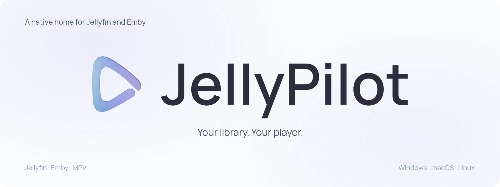
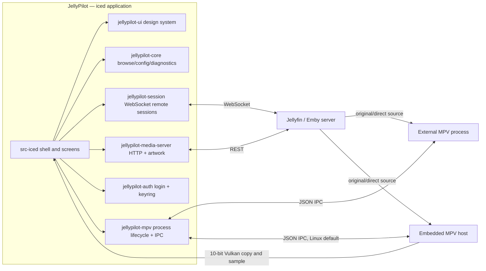

<div align="center">



# JellyPilot

[](https://github.com/hewel/jellypilot/actions/workflows/ci.yml)
[](https://www.rust-lang.org/)
[](https://iced.rs/)
[](LICENSE)

**A native Jellyfin and Emby companion: library browser, cast receiver, and playback controller — Linux plays through the pinned Embedded MPV fork.**

Custom-drawn with Rust and [iced](https://iced.rs/). Cross-platform. No webview or forced transcoding. External MPV remains available, and is the default on Windows and macOS.

</div>

---

## 📖 Overview

JellyPilot signs in to Jellyfin or Emby, browses your video libraries, and on Linux defaults to **Embedded MPV Playback**: the pinned project-owned mpv fork presented inside the existing player surface with an application-owned baseline. It does not load your external MPV configuration. **External MPV Playback** remains available (your configuration, shaders, and scripts stay in charge) and is the default on Windows and macOS.

Jellyfin clients can discover JellyPilot as a cast target. Both Jellyfin and Emby sessions can mirror supported remote transport commands to the app, the player bar, and the system tray.

## 🖼️ Screenshots

### Full library and playback

<a href="assets/screenshots/Screenshot%20from%202026-09-06%2023-48-49.png">
  
</a>

<p align="center"><sub>Dark theme · Home and playback controls</sub></p>

### Library browsing

<a href="assets/screenshots/Screenshot%20from%202026-09-06%2023-49-02.png">
  
</a>

<p align="center"><sub>Dark theme · Series library and filters</sub></p>

### Control-Only mode

<p align="center">
  <a href="assets/screenshots/Screenshot%20from%202026-09-02%2017-31-01.png">
    
  </a>
</p>

<p align="center"><sub>Control-Only mode · Queue, tracks, transport, and volume</sub></p>

## ✨ Features

| Feature                       | Description                                                                                          |
| :---------------------------- | :--------------------------------------------------------------------------------------------------- |
| 🎞️ **Jellyfin + Emby**        | Connect to Jellyfin or Emby servers with saved service profiles                                      |
| 📚 **Library Browser**        | Movies, shows, and search with persisted filters, virtualized grids, and disk-cached artwork         |
| ⭐ **User Data Actions**     | Favorite or unfavorite items and mark them played or unplayed directly from item details             |
| 📺 **Jellyfin Cast Target**   | Appears as a controllable device in Jellyfin's cast menu                                             |
| 🎬 **Embedded MPV Playback**  | Linux default: pinned mpv fork inside the player surface, with an application-owned baseline         |
| 🚀 **External MPV Playback**  | Standalone MPV over JSON IPC; your configuration, shaders, and scripts apply to the original source  |
| 📑 **Episode Queue**          | Current-season episode list in the player bar and compact player — click any episode to switch       |
| 💬 **External Subtitles**     | Server-hosted external subtitle tracks loaded into MPV, with the default selection applied           |
| ✂️ **Intro Skipper**          | Skips Jellyfin native intro and credit ranges, including multiple ranges of the same type             |
| 🌐 **Subtitle Preferences**  | Configurable preferred subtitle languages passed directly to MPV                                    |
| ⏭️ **Smart Playback**         | Automatic next episode on natural end, plus episode navigation from the player bar or tray           |
| 🎛️ **Control-Only Mode**      | A compact always-on-top-style controller window without the library shell                            |
| 🌗 **Light + Dark Themes**    | System-following palettes from one design-token set                                                  |
| 🔒 **Persistent Auth**        | Login once, stay connected; access tokens live in the OS keychain                                    |
| 🔑 **Jellyfin Quick Connect** | Authenticate by approving a one-time code on another device                                          |
| 🔄 **Auto-Reconnect**         | Resilient WebSocket connection with exponential backoff                                              |
| ⌨️ **Shortcuts**              | Configurable shortcuts: `Shift+>` / `Shift+<` for episodes and `g` for intro skipping by default     |
| 🖥️ **System Tray**            | Background operation with transport controls, show window, and quit                                  |
| 🍏 **Cross-Platform**         | Native support for Windows, macOS, and Linux from one custom-drawn codebase                          |

## 🧩 Server Support

| Server       | Supported | Notes                                                                                                                                          |
| :----------- | :-------- | :--------------------------------------------------------------------------------------------------------------------------------------------- |
| **Jellyfin** | ✅        | Password login, Quick Connect, saved profiles, library browsing, user data actions, MPV playback, cast target registration, remote control, Intro Skipper support |
| **Emby**     | ✅        | Password login, saved profiles, library browsing, user data actions, MPV playback, remote control, and playback progress reporting                                |

Emby support uses the same library and player workflow as Jellyfin where the server APIs are compatible. Jellyfin-specific features such as Quick Connect and Intro Skipper are not advertised for Emby connections.

Jellyfin 12.0 does not require legacy authorization to be enabled: JellyPilot uses the standard
`Authorization` header for API requests and `ApiKey` for playback, subtitles, and remote sessions.
Enter the server's actual base URL, including any configured reverse-proxy base path; Jellyfin 12
removed the automatic `/emby` and `/mediabrowser` route aliases.

Intro Skipper reads Jellyfin's native media segments, including ranges published by the Intro Skipper
plugin or another server provider. Automatic, Manual, and Off still apply to intro/credit ranges only;
each range is handled independently. The deprecated plugin endpoint is no longer used. If no native
ranges are available, playback continues without skipping; ensure the server's segment extraction or
plugin synchronization has populated them.

## 🗺️ Roadmap

- [ ] **MPRIS support** — Linux desktop media-player integration for keys and widgets

## 🚀 Quick Start

### Runtime prerequisites

- Embedded playback (Linux default): the exact host-enabled libmpv build and baseline below, plus Linux Vulkan with a supported `Rgb10a2Unorm` presentation surface. Missing capability is an error, not an eight-bit, software, system-libmpv, or external-player fallback.
- External playback: [MPV](https://mpv.io/) with Lua scripting support, available on `PATH` or selected explicitly in Settings. A bundled Lua hook captures volume and temporary mute before MPV resets file-local options at the end of playback. Default on Windows and macOS.

### Installation

#### Arch Linux

Install the prebuilt package from the AUR:

```bash
paru -S jellypilot-bin
```

Or build from source:

```bash
paru -S jellypilot
```

`yay` and other AUR helpers work the same way. The two packages conflict; pick one.
Linux packages install the pinned mpv fork at `/usr/lib/jellypilot/libmpv.so` and
`/usr/share/jellypilot/mpv-baseline.conf`. A packaged `/usr/bin/jellypilot` starts
Embedded MPV Playback with that fork. External MPV is optional and requires a
system `mpv` if you switch to it in Settings.

#### Build from Source

<details>
<summary>Development prerequisites</summary>

- [Rust](https://rustup.rs/) 1.98 or newer
- [Bun](https://bun.sh/) 1.3.14 or newer (task dispatcher only — there is no JavaScript frontend)
- Linux: GTK 3, `libxkbcommon`, and Wayland development packages

</details>

```bash
git clone https://github.com/hewel/jellypilot.git
cd jellypilot
bun install --frozen-lockfile
bun run task iced build --release
```

The release binary is `target/release/jellypilot`.

Maintained Cargo tasks prepare the repository-owned `target/vendor/iced` before building.
`tools/embedded-mpv/iced-source.json` is the authority for the published fork revision and
remote. Preparation fetches that exact commit remotely, verifies HEAD and tracked cleanliness,
and makes all iced crates use the same checkout. There is no checked-in patch or fallback
revision. Existing owned vendor checkouts are preserved when the stable link changes.
An inaccessible commit fails explicitly. An optional local source can provide the same
committed contents without being modified; it is not the remote cold-prepare acceptance path:

```bash
bun run task iced prepare --source /absolute/path/to/iced
```

### Embedded MPV: build, select, and recover

This accepted integration supersedes ADR 0027's external-only playback restriction, not its
native iced/no-webview decision. Linux defaults to Embedded MPV Playback with the pinned
fork, including a one-time migration of existing settings that still recorded External.
Windows and macOS keep External. In **Settings → Playback**, select External if you want
your own MPV process, configuration, shaders, and scripts; restart to apply. Switching
preserves the external executable and arguments. **Show video** opens the player surface
while browsing. The same player, transport, queue, volume, subtitles, and remote-session
controller are reused.

The embedded player uses one full-window video surface with floating controls in both windowed
and fullscreen playback; the video keeps its aspect ratio without cropping.

| Input | Embedded player action |
|---|---|
| Left / Right | Seek −5 / +5 seconds; held keys repeat |
| Up / Down | Volume +5 / −5 percentage points, limited to 0–100%; held keys repeat |
| F | Toggle fullscreen; held-key repeats ignored |
| Esc | Leave fullscreen; an open menu or modal takes priority |
| Space / click video | Toggle pause; Space repeats ignored |
| Back button | Stop playback, then restore the source page and leave fullscreen |

These keys apply only while the embedded player is visible, not while browsing. Captured input,
menus, modals and shortcut capture take priority; the listed unmodified keys are reserved in the
player. Other configured episode/intro bindings remain available. Search is unavailable within
the standalone player; Settings can open over windowed playback.

The cursor reappears on any pointer movement and hides after three idle seconds while playing,
independently of the controls. Moving near the bottom control area (including a 48px approach
band) reveals the bar; movement over the middle of the picture does not reveal or prolong it.
The top-left Back button has its own reveal region and three-second timeout. Pausing,
dragging, open menus and an intro prompt keep controls visible. Keyboard seek and volume
changes show brief feedback. Hovering the timeline previews its time; dragging changes
the target preview and seeks once on release. Seek availability retains the existing positive,
finite-duration check, not a separate backend seekability signal. A failed Stop keeps the player
open so Back can be retried.

Slider keyboard/wheel adjustments submit immediately rather than waiting for a mouse release.
Switching fullscreen during a drag cancels its unfinished preview; releasing afterward does not
submit the cancelled target. Clicking the picture outside an open player menu only dismisses
that menu and does not pause or resume playback.

The bar uses a translucent background without blur. Its transport stays centered in one row
down to 768 logical pixels; at 900 pixels and below, the landscape thumbnail is hidden.

```bash
# Linux prerequisites: Meson >=1.3, Ninja, C/C++ compiler, pkg-config,
# Vulkan development headers/loader, FFmpeg, libplacebo >=7.360.1, libass.
bun run task mpv build --source /absolute/path/to/mpv
bun run task iced run
```

`tools/embedded-mpv/source.json` is the authority for the mpv revision, baseline and Meson
options. The supplied source must be at that revision with no tracked changes. Without
`--source`, the task fetches that revision from the configured fork; an inaccessible
revision is a hard prerequisite failure. No source commit or push is performed.

The build stages `target/embedded-mpv/lib/jellypilot/libmpv.so`,
`target/embedded-mpv/share/jellypilot/mpv-baseline.conf`, and `manifest.json`.
The manifest records source, configuration, tool/dependency versions and artifact hashes.
Source and options are pinned; host libraries/compiler and auto-selected dependencies are
recorded, **not pinned**, so this is not a bit-reproducible or self-contained distribution.
Vulkan headers may be supplied explicitly through `CFLAGS=-I/absolute/sdk/include` (and
dependencies through `PKG_CONFIG_PATH`); neither is silently obtained from another build tree.

Development run/hot commands pass staged asset paths for the Linux Embedded default and for
saved Embedded settings. Absolute `JELLYPILOT_LIBMPV` and `JELLYPILOT_MPV_BASELINE` overrides are
supported; only trusted files implementing the pinned host ABI may be loaded. A directly
launched binary looks beside itself, then in the executable prefix (`../lib/jellypilot` and
`../share/jellypilot`), so `/usr/bin/jellypilot` loads `/usr/lib/jellypilot/libmpv.so`.
Linux packages ship that pinned fork; they do not use system libmpv. Missing Vulkan or
host assets is an error, not a fallback to system libmpv or External MPV. To start External
MPV instead, launch `jellypilot --external` or select External in Settings and restart.

The host retains the actual enabled Vulkan feature chain and shares its device/queue with
the official iced renderer. Video reaches a private 10-bit texture through three ordered
command buffers: tracked `COPY_DST` transition, raw copy, tracked `RESOURCE` transition.
Queue submissions, acquisition/presentation/discard and image/screenshot submits share a
gate; device polling and synchronous mpv calls stay outside it. MPV owns playback time.
The private launcher contains only the two unsafe engine/surface handoffs; Vulkan/libmpv
FFI lives in `jellypilot-mpv-host`, while `src-iced` retains its unsafe-code prohibition.
This does not claim HDR, hardware decoding, zero-copy playback, or downstream compositor
presentation feedback. Non-Linux embedded startup is explicitly unavailable.
The daemon factory retains the host/device resources across last-window close; reopening
creates a new surface and renderer for the same playback session. Daemon exit terminates
mpv before removing its process-private IPC directory.

### Fork maintenance and joint acceptance

The locked combination is the **JellyPilot commit and its working-tree state**, `Cargo.lock`,
`tools/embedded-mpv/iced-source.json`, and `tools/embedded-mpv/source.json`, together with the
staged `target/embedded-mpv/manifest.json` and the actual library/baseline hashes. The manifests
and lockfile are the source of truth; this document intentionally has no second version table.
The native manifest records host tools and dependencies, not a bit-reproducible environment.
An override library is not attested by the staged manifest: retain its actual hash and origin.

For an upstream synchronization, work on a disposable sync branch in each affected fork.
Read the [iced maintenance guide](https://github.com/hewel/iced/blob/main/FORK_MAINTENANCE.md)
and [mpv maintenance guide](https://github.com/hewel/mpv/blob/iced-player/DOCS/fork-maintenance.md).
Review the upstream range and the fork's actual ABI/source changes; do not invent an ABI
version bump when no ABI contract changes. Publish the candidate fork commits through the
normal owner workflow, update the application manifests as one candidate combination, then:

1. In a fresh application checkout, run `bun install --frozen-lockfile` and
   `bun run task iced prepare` **without `--source`**. Preparation must fetch the manifest's
   exact published commit and all iced packages must resolve under `target/vendor/iced`.
2. Build the pinned mpv with `bun run task mpv build`, preserving its generated manifest and
   any explicit SDK/dependency inputs. Run the applicable [project gates](docs/agents/validation.md).
3. Run `bun run task iced regress all --file /absolute/path/to/real-moving-clip.mp4`.
   This is the sole joint-probe entry; [native regression policy](docs/agents/validation.md#opt-in-native-regressions)
   defines prerequisites and evidence. A missing GPU fixture is rejected before preparation,
   build or application startup. Normal run/hot/smoke commands do not enable these probes.
4. Complete the separate [manual color comparison](#manual-three-way-color-comparison).
   Review the exact candidate combination, current-run automatic report, human record and
   explicitly unavailable coverage before accepting a sync. A passing lifecycle probe alone
   is not color, HDR presentation, hardware decoding or Dolby Vision acceptance.

The default local artifact directory is `target/native-regression/`: `report.json` aggregates
only the requested scenarios; `tray.json`, `external.json` and `gpu.json` carry individual
results. Every automatic report has a fresh `runId`; every scenario is `pass`, `fail` or
`unavailable`. Check both the command exit status and that identity, not an old file's presence.
Unrequested scenario files can belong to earlier runs. Preserve reports outside this directory
before the next invocation if needed. These ignored local artifacts are not published docs.

Rollback means restoring the **last accepted combination**, not mixing one old library with
new host bindings. Preserve the pre-sync application revision, source manifests/lockfile,
baseline, native build manifest and binary hashes before changing pins. In a separate checkout
of that accepted application revision, prepare its iced pin and rebuild/stage its mpv pin
with the recorded inputs, or restore its verified archived artifacts. Keep the candidate tree
and local work intact. Start with `jellypilot --external` if embedded prerequisites are absent,
then rerun the applicable gates and joint acceptance before calling embedded recovery complete.

### Manual three-way color comparison

This is a **human** protocol, separate from the automatic GPU lifecycle probe. Keep
`target/native-regression/color-comparison.json` as a human-authored record; the regression
command never writes it, captures reference images, changes display settings, or updates a
reference to make a candidate pass. Retain the old accepted native binary and baseline before
the sync; if they are unavailable, mark that comparison `unavailable`, not equivalent.

Compare **old accepted native mpv / candidate native mpv / candidate embedded JellyPilot**.
The native executables must come from the respective recorded fork revisions, not an
unidentified system `mpv`. The application mpv build stages libmpv only; obtain native comparison
binaries from the corresponding fork build workflow and record their source/binary hashes.
Use the same explicitly loaded, hash-recorded baseline (`--no-config --include=<baseline>`
for native mpv) and record the embedded host backend differences; do not silently change color,
tone-mapping, scaling or hardware-decoding options between columns.

For each of **SDR**, **HDR10**, and **Dolby Vision Profile 5**:

- Use a real authorized local fixture. Record its hash and ffprobe stream metadata: codec,
  dimensions, pixel format, color primaries/transfer/matrix/range, and HDR/DOVI side data.
  HDR10 requires actual PQ/BT.2020/HDR metadata evidence. Profile 5 requires an actual DOVI
  configuration record identifying `dv_profile=5`; a filename, HEVC 10-bit stream, BT.2020 tag,
  synthetic pattern or another DV profile is not proof. Missing evidence or fixture is
  `unavailable`; do not synthesize a substitute and claim Profile 5 coverage.
- Fix and record the same timestamp/frame, physical video-picture dimensions (not logical
  window size), monitor, compositor session, display mode/HDR state, scaling and baseline
  hash for all three columns. Pause at the agreed timestamp, wait for the decoded frame,
  and compare the same picture region with overlays removed equally.
- The human checks hue/skin tones, neutral grays, shadow detail, highlights/clipping,
  saturation and gradients. Record what was actually observed and the compared column pair,
  with `pass`, `fail` or `unavailable`, reviewer and timestamp. Do not promote screenshot
  byte differences or an automated decode success to a visual conclusion.
- Identify the run and candidate/accepted artifacts in the human record and link any
  intentionally captured human evidence. Automatic `report.json` continues to describe only
  automated coverage. Approval or replacement of an old reference is a separate explicit
  human decision; retain the old record rather than overwriting it during a sync.

### Usage

1. **Launch JellyPilot** from your application menu or terminal.
2. **Choose a server type**: Jellyfin or Emby on the login screen.
3. **Authenticate** with your Server URL and credentials; Jellyfin also supports Quick Connect.
4. **Browse and manage your library**: open item details to update favorite or played state.
5. **Play or cast**: start playback directly in JellyPilot, or cast to "JellyPilot" from another Jellyfin client.
6. **Control playback** from the player bar, the system tray, or a supported Jellyfin/Emby remote session — open the episode queue to jump anywhere in the current season.
7. **Switch app modes** from Settings: Full library mode, or Control-Only — a compact standalone controller window.

**Season volume memory** is enabled by default under **Settings → Playback**. Player volume
adjustments are remembered per season on this device, separately for each server and account.
The next episode, a manually selected episode, or a later session restores that season's volume
before playback starts. Movies and episodes without a saved, reliably identified season use
MPV's startup volume instead. This remembers the player's volume, not system volume, and does
not normalize audio loudness.

Turning the switch off stops saving and restoring without deleting existing records or changing
the current volume. Turning it back on restores saved values on the next load. Temporary mute
is retained during continuous episode playback, but is not saved for a later playback session.

## 🏗️ Architecture

One Rust workspace: `jellypilot-ui` owns the custom iced presentation layer, while the domain and infrastructure crates remain display-free and test-covered.



- `src-iced` — the application: shell, screens, tray, subscriptions, orchestration.
- `crates/jellypilot-launcher` — executable-only entry point and private unsafe engine/surface handoffs.
- `crates/jellypilot-mpv-host` — Linux host ABI, retained Vulkan device/features, bounded producer images and GPU copy lifecycle.
- `crates/jellypilot-ui` — the design system: tokens, theme/Catalog styles, custom widgets, overlay.
- `crates/jellypilot-core` — display-free browse model, configuration, request gate, diagnostics, artwork load planning.
- `crates/jellypilot-media-server` — Jellyfin/Emby HTTP adapter over the generated OpenAPI clients in `crates/media-server-api/`.
- `crates/jellypilot-auth` — login workflows and OS keychain token storage.
- `crates/jellypilot-mpv` — MPV process lifecycle and JSON IPC protocol.
- `crates/jellypilot-session` — media-server WebSocket remote-control sessions.

## 💻 Development

### Commands

| Task                       | Command                                     |
| :------------------------- | :------------------------------------------ |
| **Run the app**            | `bun run task iced run`                     |
| **Startup smoke gate**     | `xvfb-run -a bun run task iced run --smoke` |
| **Check everything**       | `bun run check`                             |
| **Rust tests**             | `bun run task rust test`                    |
| **Rust clippy**            | `bun run task rust clippy`                  |
| **Regenerate API clients** | `bun run task api`                          |

### Conventions

- **Rust**: formatting is enforced by `bun run task rust fmt`; `unsafe_code` is forbidden workspace-wide; clippy warnings are errors.
- **Display-free logic** lives in `jellypilot-core` and is tested there; `src-iced` keeps orchestration and views.
- **Domain language**: [CONTEXT.md](CONTEXT.md) is the glossary; [docs/adr/](docs/adr/) records architecture decisions.
- **Design and promo artwork**: logo sources, screenshots, fonts, and the renderer live in the separate `jellypilot-design` project. From that checkout, run `bun run promo`, then preview publication with `bun run sync:app -- /absolute/path/to/jellypilot`; add `--write` to copy the selected exports. This repository keeps the published files in `assets/promo/` and `assets/screenshots/`, plus the logo used by those assets.

## 📜 Project History

Releases ≤ 1.4.x shipped a Tauri/Solid.js frontend with an embedded web player and a local FFmpeg HLS pipeline. That stack was retired per [ADR 0027](docs/adr/0027-cross-platform-iced-frontend.md). Linux now defaults to the pinned Embedded MPV fork ([ADR 0040](docs/adr/0040-linux-embedded-mpv-default.md)); settings and saved profiles start fresh — no Tauri Store data is imported.

## 🙏 Credits

- [MPV](https://mpv.io/) — the best media player in existence.
- [iced](https://iced.rs/) — the cross-platform GUI library this app is drawn with.
- [Jellyfin](https://jellyfin.org/) and [Emby](https://emby.media/) — the media servers JellyPilot companions.
