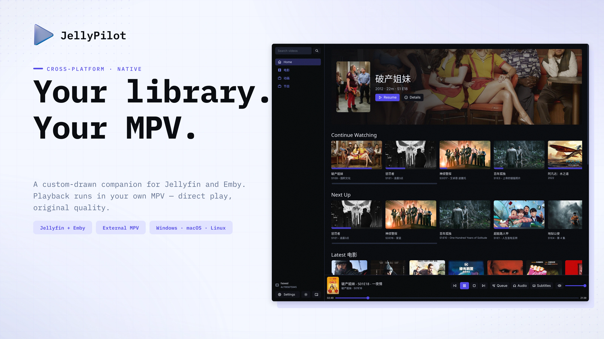
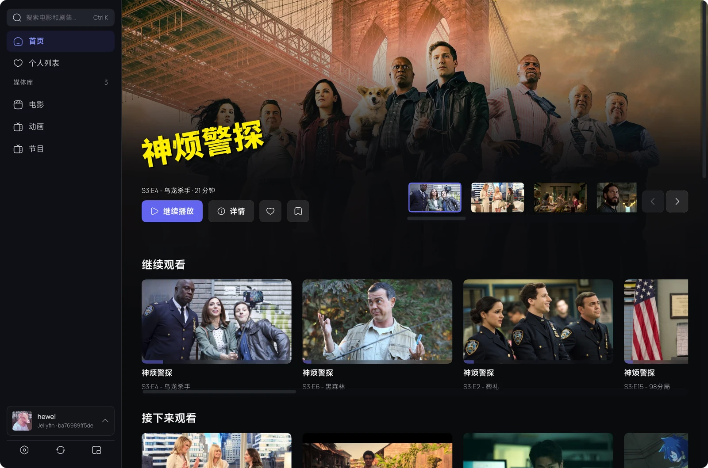
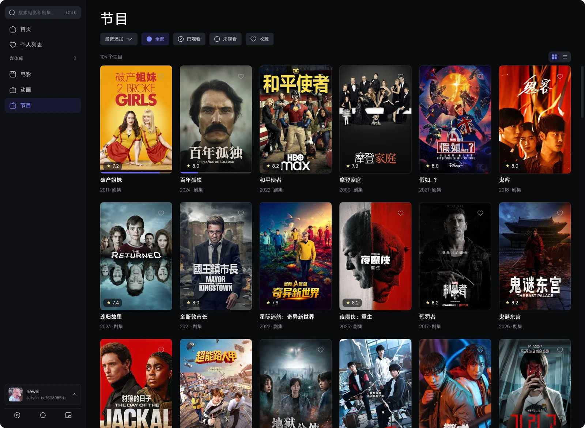
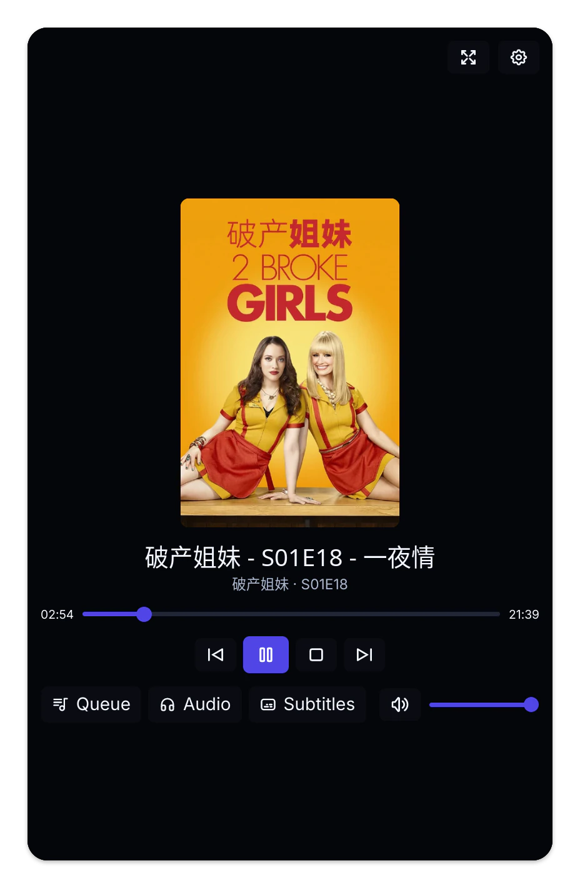
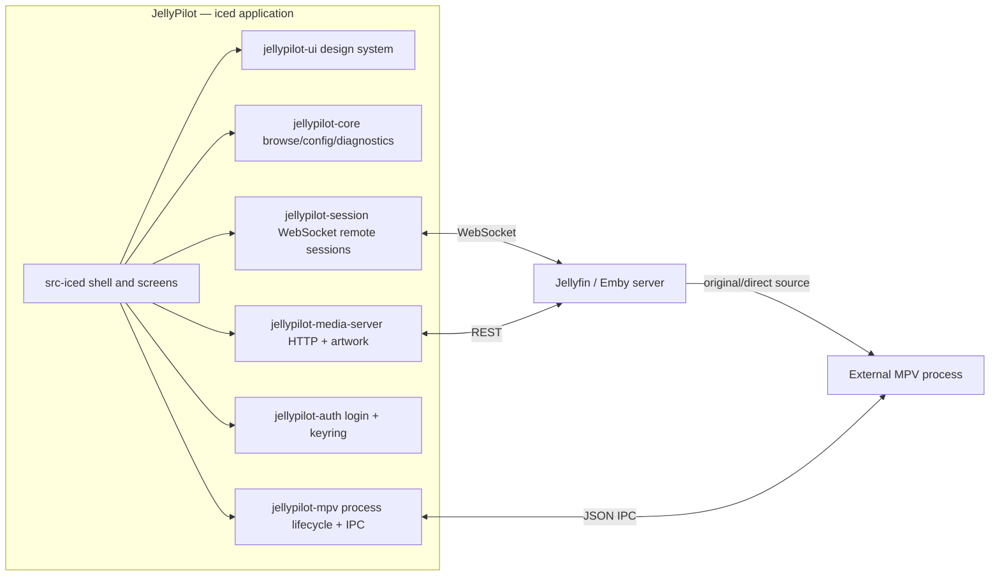

<div align="center">



# JellyPilot

[](https://github.com/hewel/jellypilot/actions/workflows/ci.yml)
[](https://www.rust-lang.org/)
[](https://iced.rs/)
[](LICENSE)

**A native Jellyfin and Emby companion: library browser, cast receiver, and playback controller — always playing through your own MPV.**

Custom-drawn with Rust and [iced](https://iced.rs/). Cross-platform. No webview, no embedded player, no forced transcoding.

</div>

---

## 📖 Overview

JellyPilot signs in to Jellyfin or Emby, browses your video libraries, and drives **External MPV Playback**: a standalone MPV process controlled over JSON IPC. Your MPV configuration, shaders, and scripts stay in charge — JellyPilot never embeds `libmpv`, never uses a webview, and never asks the server to transcode.

Jellyfin clients can discover JellyPilot as a cast target. Both Jellyfin and Emby sessions can mirror supported remote transport commands to the app, the player bar, and the system tray.

## 🖼️ Screenshots

### Full library and playback

<a href="assets/screenshots/Screenshot%20from%202026-09-02%2017-30-56.png">
  
</a>

<p align="center"><sub>Dark theme · Home and playback controls</sub></p>

### Library browsing

<a href="assets/screenshots/Screenshot%20from%202026-09-02%2017-29-31.png">
  
</a>

<p align="center"><sub>Light theme · Movie library and filters</sub></p>

### Control-Only mode

<p align="center">
  <a href="assets/screenshots/Screenshot%20from%202026-09-02%2017-31-01.png">
    
  </a>
</p>

<p align="center"><sub>Control-Only mode · Queue, tracks, transport, and volume</sub></p>

## ✨ Features

| Feature                       | Description                                                                                          |
| :---------------------------- | :--------------------------------------------------------------------------------------------------- |
| 🎞️ **Jellyfin + Emby**        | Connect to Jellyfin or Emby servers with saved service profiles                                      |
| 📚 **Library Browser**        | Movies, shows, and search with persisted filters, virtualized grids, and disk-cached artwork         |
| ⭐ **User Data Actions**     | Favorite or unfavorite items and mark them played or unplayed directly from item details             |
| 📺 **Jellyfin Cast Target**   | Appears as a controllable device in Jellyfin's cast menu                                             |
| 🚀 **External MPV Playback**  | Standalone MPV over JSON IPC; your configuration, shaders, and scripts apply to the original source  |
| 📑 **Episode Queue**          | Current-season episode list in the player bar and compact player — click any episode to switch       |
| 💬 **External Subtitles**     | Server-hosted external subtitle tracks loaded into MPV, with the default selection applied           |
| ✂️ **Intro Skipper**          | Skips Jellyfin Intro Skipper plugin intro and credit ranges during playback                          |
| 🌐 **Subtitle Preferences**  | Configurable preferred subtitle languages passed directly to MPV                                    |
| ⏭️ **Smart Playback**         | Automatic next episode on natural end, plus episode navigation from the player bar or tray           |
| 🎛️ **Control-Only Mode**      | A compact always-on-top-style controller window without the library shell                            |
| 🌗 **Light + Dark Themes**    | System-following palettes from one design-token set                                                  |
| 🔒 **Persistent Auth**        | Login once, stay connected; access tokens live in the OS keychain                                    |
| 🔑 **Jellyfin Quick Connect** | Authenticate by approving a one-time code on another device                                          |
| 🔄 **Auto-Reconnect**         | Resilient WebSocket connection with exponential backoff                                              |
| ⌨️ **Shortcuts**              | Configurable shortcuts: `Shift+>` / `Shift+<` for episodes and `g` for intro skipping by default     |
| 🖥️ **System Tray**            | Background operation with transport controls, show window, and quit                                  |
| 🍏 **Cross-Platform**         | Native support for Windows, macOS, and Linux from one custom-drawn codebase                          |

## 🧩 Server Support

| Server       | Supported | Notes                                                                                                                                          |
| :----------- | :-------- | :--------------------------------------------------------------------------------------------------------------------------------------------- |
| **Jellyfin** | ✅        | Password login, Quick Connect, saved profiles, library browsing, user data actions, MPV playback, cast target registration, remote control, Intro Skipper support |
| **Emby**     | ✅        | Password login, saved profiles, library browsing, user data actions, MPV playback, remote control, and playback progress reporting                                |

Emby support uses the same library and player workflow as Jellyfin where the server APIs are compatible. Jellyfin-specific features such as Quick Connect and the Jellyfin Intro Skipper plugin are not advertised for Emby connections.

## 🗺️ Roadmap

- [ ] **MPRIS support** — Linux desktop media-player integration for keys and widgets

## 🚀 Quick Start

### Runtime prerequisites

- [MPV](https://mpv.io/) available on `PATH` or selected explicitly in Settings — it is the only playback engine.

### Installation

#### Arch Linux

Until `jellypilot-bin` is published to the AUR, download the native
`jellypilot-2.0.0-1-x86_64.pkg.tar.zst` asset from the
[v2.0.0 release](https://github.com/hewel/jellypilot/releases/tag/v2.0.0) and install it directly:

```bash
sudo pacman -U ./jellypilot-2.0.0-1-x86_64.pkg.tar.zst
```

#### Build from Source

<details>
<summary>Development prerequisites</summary>

- [Rust](https://rustup.rs/) 1.98 or newer
- [Bun](https://bun.sh/) 1.3.14 or newer (task dispatcher only — there is no JavaScript frontend)
- Linux: GTK 3, `libxkbcommon`, and Wayland development packages

</details>

```bash
git clone https://github.com/hewel/jellypilot.git
cd jellypilot
bun install --frozen-lockfile
bun run task iced run --release
```

The release binary is `target/release/jellypilot`.

### Usage

1. **Launch JellyPilot** from your application menu or terminal.
2. **Choose a server type**: Jellyfin or Emby on the login screen.
3. **Authenticate** with your Server URL and credentials; Jellyfin also supports Quick Connect.
4. **Browse and manage your library**: open item details to update favorite or played state.
5. **Play or cast**: start playback directly in JellyPilot, or cast to "JellyPilot" from another Jellyfin client.
6. **Control playback** from the player bar, the system tray, or a supported Jellyfin/Emby remote session — open the episode queue to jump anywhere in the current season.
7. **Switch app modes** from Settings: Full library mode, or Control-Only — a compact standalone controller window.

## 🏗️ Architecture

One Rust workspace: `jellypilot-ui` owns the custom iced presentation layer, while the domain and infrastructure crates remain display-free and test-covered.



- `src-iced` — the application: shell, screens, tray, subscriptions, orchestration.
- `crates/jellypilot-ui` — the design system: tokens, theme/Catalog styles, custom widgets, overlay.
- `crates/jellypilot-core` — display-free browse model, configuration, request gate, diagnostics, artwork load planning.
- `crates/jellypilot-media-server` — Jellyfin/Emby HTTP adapter over the generated OpenAPI clients in `crates/media-server-api/`.
- `crates/jellypilot-auth` — login workflows and OS keychain token storage.
- `crates/jellypilot-mpv` — MPV process lifecycle and JSON IPC protocol.
- `crates/jellypilot-session` — media-server WebSocket remote-control sessions.

## 💻 Development

### Commands

| Task                       | Command                                     |
| :------------------------- | :------------------------------------------ |
| **Run the app**            | `bun run task iced run`                     |
| **Startup smoke gate**     | `xvfb-run -a bun run task iced run --smoke` |
| **Check everything**       | `bun run check`                             |
| **Rust tests**             | `bun run task rust test`                    |
| **Rust clippy**            | `bun run task rust clippy`                  |
| **Regenerate API clients** | `bun run task api`                          |
| **Render promo artwork**   | `bun run task promo`                        |

### Conventions

- **Rust**: formatting is enforced by `bun run task rust fmt`; `unsafe_code` is forbidden workspace-wide; clippy warnings are errors.
- **Display-free logic** lives in `jellypilot-core` and is tested there; `src-iced` keeps orchestration and views.
- **Domain language**: [CONTEXT.md](CONTEXT.md) is the glossary; [docs/adr/](docs/adr/) records architecture decisions.
- **Promo artwork**: `bun run task promo` writes optimized README screenshots to `assets/screenshots/` and regenerates the WebP README hero and promotional assets plus the 1280×640 PNG GitHub social preview in `assets/promo/`.

## 📜 Project History

Releases ≤ 1.4.x shipped a Tauri/Solid.js frontend with an embedded web player and a local FFmpeg HLS pipeline. That stack was retired per [ADR 0027](docs/adr/0027-cross-platform-iced-frontend.md): the iced application always presents External MPV Playback, and settings/saved profiles start fresh — no Tauri Store data is imported.

## 🙏 Credits

- [MPV](https://mpv.io/) — the best media player in existence.
- [iced](https://iced.rs/) — the cross-platform GUI library this app is drawn with.
- [Jellyfin](https://jellyfin.org/) and [Emby](https://emby.media/) — the media servers JellyPilot companions.
