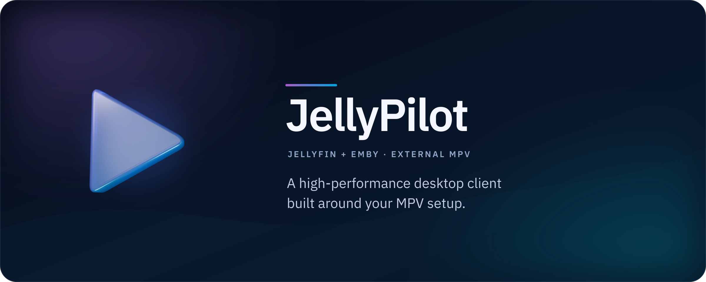
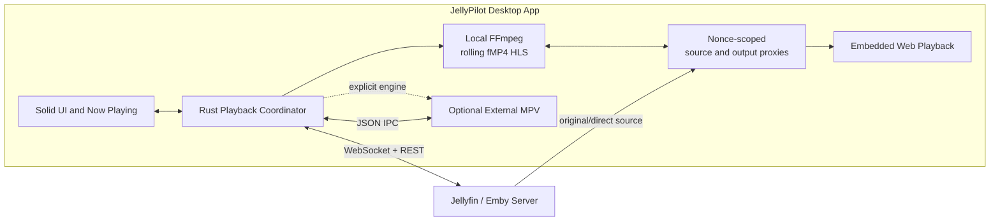

<div align="center">



# JellyPilot

[](https://github.com/hewel/jellypilot/actions/workflows/ci.yml)
[](https://www.rust-lang.org/)
[](https://v2.tauri.app/)
[](https://www.solidjs.com/)
[](LICENSE)
[](https://aur.archlinux.org/packages/jellypilot)

**A high-performance Jellyfin and Emby desktop client with embedded playback by default and optional external MPV.**

Built with Tauri v2, Solid.js, and Rust.

[Features](#-features) • [Roadmap](#️-roadmap) • [Quick Start](#-quick-start) • [Architecture](#-architecture) • [Troubleshooting](#-troubleshooting)

</div>

---

## 📖 Overview

JellyPilot lets you sign in to Jellyfin or Emby, browse your video libraries, and play Movies and Episodes inside the desktop window. Local Transcode prepares the embedded presentation without requesting a Provider Transcode. External MPV Playback remains available when you want your custom configuration, shaders, and scripts. For Jellyfin, JellyPilot can also register as a cast target for playback from other Jellyfin clients.

> **💡 Key Philosophy**
>
> Embedded Web Playback is the default, backed by local FFmpeg rolling HLS. JellyPilot never requests a Provider Transcode for this path. It still does **not** embed `libmpv`; External MPV Playback spawns and controls a standalone MPV process through JSON IPC.

## ✨ Features

| Feature                       | Description                                                                                        |
| :---------------------------- | :------------------------------------------------------------------------------------------------- |
| 🎞️ **Jellyfin + Emby**        | Connect to Jellyfin or Emby servers with saved service profiles                                    |
| 📚 **Library Browser**        | Browse Movies and Shows, open item details, and start playback from the desktop app                |
| 📺 **Jellyfin Cast Target**   | Appears as a controllable device in Jellyfin's cast menu                                           |
| ▶️ **Embedded Web Playback**  | Default in-window playback with a local rolling HLS pipeline and no Provider Transcode             |
| 🚀 **Optional External MPV**  | Explicit engine choice and fallback with full compatibility for your MPV configuration and shaders |
| 🛡️ **Type-Safe**              | 100% type-safe Rust-to-TypeScript communication via `tauri-specta`                                 |
| 🔒 **Persistent Auth**        | Login once, stay connected with secure token storage                                               |
| 🔑 **Jellyfin Quick Connect** | Authenticate with Jellyfin by approving a one-time code on another device                          |
| 🔄 **Auto-Reconnect**         | Resilient WebSocket connection with exponential backoff strategy                                   |
| ⏭️ **MPV Smart Playback**     | External MPV Playback can automatically start the next episode                                     |
| ✂️ **MPV Intro Skipper**      | External MPV Playback can skip Jellyfin Intro Skipper plugin introduction and credit ranges        |
| 🧠 **Series Memory**          | Remembers MPV audio/subtitle preferences; Embedded Web Playback uses the initial audio preference  |
| ⌨️ **Shortcuts**              | Use configurable MPV shortcuts (`Shift+>` / `Shift+<` by default) to skip episodes                 |
| 🖥️ **System Tray**            | Runs quietly in the background with quick access controls                                          |
| 🍏 **Cross-Platform**         | Native support for Windows, macOS, and Linux                                                       |

## 🧩 Server Support

| Server       | Supported | Notes                                                                                                                                                              |
| :----------- | :-------- | :----------------------------------------------------------------------------------------------------------------------------------------------------------------- |
| **Jellyfin** | ✅        | Password login, Quick Connect, saved profiles, library browsing, embedded or MPV playback, cast target registration, remote control, and MPV Intro Skipper support |
| **Emby**     | ✅        | Password login, saved profiles, library browsing, embedded or MPV playback, remote control, and playback progress reporting                                        |

Emby support uses the same library and player workflow as Jellyfin where the server APIs are compatible. Jellyfin-specific features such as Quick Connect and the Jellyfin Intro Skipper plugin are not advertised for Emby connections.

## 🗺️ Roadmap

- [x] **[Quick Connect](https://jellyfin.org/docs/general/server/quick-connect/)** - Login via code from another device
- [x] **[Intro Skipper](https://github.com/intro-skipper/intro-skipper) Integration** - Auto-skip intros/credits
- [ ] **Full-Featured Client UI** - Browse libraries, manage media, and control playback like other media server clients
- [x] **Embedded Player Direction** - Embedded Web Playback is the default engine; the first local-transcode slice is defined below
- [ ] **MPRIS Support** - Linux media player integration for desktop controls

### Embedded playback first slice

Embedded Web Playback always uses local FFmpeg to produce a rolling fragmented-MP4 HLS presentation with four-second segments and an approximately sixty-second window. Jellyfin and Emby supply the original/direct source; Provider Transcode is disabled for this path.

| Included                                                           | Not in the first slice                                   |
| :----------------------------------------------------------------- | :------------------------------------------------------- |
| Movies and Episodes                                                | Audio-only media, live TV, and DRM                       |
| SDR H.264 `yuv420p` output                                         | Subtitles and in-session track switching                 |
| Preserved HDR HEVC Main 10, without tone mapping                   | HDR-to-SDR tone mapping                                  |
| AAC stereo or multichannel audio with the initial audio preference | Intro Skipper, next/previous, and automatic next episode |
| One local HLS rendition                                            | Adaptive bitrate ladders                                 |

HDR HEVC playback requires WebView support for the preserved Main 10 output. If that capability is unavailable, JellyPilot reports the problem and offers **Play in MPV** at the last known position. It never silently changes engines or changes the saved Playback Engine Preference.

## 📦 Release Notes

### v1.4.2

- Added Emby media server support: login, library browsing, playback, and progress reporting.
- Completed full Panda CSS styling cutover across all application surfaces.
- Added collapsible sidebar with compositor-animated FLIP transitions.
- Virtualized large browse grids with prefetched paging and persisted filter state.
- Redesigned item detail pages for desktop with back navigation and scroll restore.
- Published to the AUR as [`jellypilot`](https://aur.archlinux.org/packages/jellypilot).

### v1.4.1

- Migrated navigation and layout architecture to TanStack Router file-based nested routing.
- Adopted vanilla-extract for design tokens and component-specific styling.
- Added media info hover-cards, playback stream selection, and Intro Skipper manual skip prompt.
- Migrated from Biome to Oxc linting/formatting.

### v1.4.0

- Added saved-session route gating and automatic reconnect through the authenticated session access path.
- Added mute-state visibility to the Now Playing controls.
- Improved Player Bridge command handling, playback control sharing, and Jellyfin websocket ownership for more reliable external MPV control.

### v1.3.2

- Migrated login, diagnostics, settings, subtitle priorities, session dialog, and now playing controls to headless Ark UI Solid primitives while preserving JellyPilot Control Room styling and behavior.

### v1.3.1

- Added Arch Linux `.pkg.tar.zst` release packaging.

### v1.3.0

- Added Intro Skipper plugin support for automatic introduction and credit skips.
- Added a global Automation toggle to enable or disable Intro Skipper behavior.
- Added once-per-session skip semantics so manual seeks back into skipped ranges are respected.
- Added verification coverage for plugin failures, malformed ranges, disabled behavior, progress reporting, and existing track controls.

## 🏗️ Architecture

JellyPilot separates playback policy, local media preparation, and presentation so engine selection does not change media-server session semantics.



The persisted Playback Engine Preference is applied when the next playback starts. A per-play override may choose another engine. Changing the preference never migrates the current session, and an embedded failure offers an explicit MPV retry instead of automatic failover.

## 🚀 Quick Start

### Runtime prerequisites

- A compatible [FFmpeg](https://ffmpeg.org/) executable for Embedded Web Playback. Release packages either include it or declare it as a dependency.
- [MPV](https://mpv.io/) is optional and needed only when External MPV Playback is selected.

### Installation

#### Download Pre-built Binaries (Recommended)

Download the latest release for your platform from the [Releases page](https://github.com/hewel/jellypilot/releases):

| Platform    | Download                                          |
| :---------- | :------------------------------------------------ |
| **Windows** | `.msi` (installer) or `.exe` (NSIS)               |
| **macOS**   | `.dmg`                                            |
| **Linux**   | `.deb`, `.AppImage`, or Arch Linux `.pkg.tar.zst` |

#### Arch Linux (AUR)

Install from the [AUR](https://aur.archlinux.org/packages/jellypilot) with any AUR helper:

```bash
yay -S jellypilot
# or
paru -S jellypilot
```

Or build manually:

```bash
git clone https://aur.archlinux.org/jellypilot.git
cd jellypilot
makepkg -si
```

Install a pre-built Arch package from a release asset with:

```bash
sudo pacman -U jellypilot-<version>-1-x86_64.pkg.tar.zst
```

#### Build from Source

<details>
<summary>Development prerequisites</summary>

- [Bun](https://bun.sh/) 1.3.14 or newer
- [Rust](https://rustup.rs/) 1.85 or newer, installed with `rustup`
- The `wasm32-unknown-unknown` Rust target
- `wasm-pack` 0.15.0 exactly
- Linux only: GTK 4 development files and `pkg-config` to compile the native GTK preview
- Linux GTK Saved Profiles: an unlocked Secret Service provider such as GNOME Keyring or KWallet
- Linux native playback: [MPV](https://mpv.io/) available on `PATH`

</details>

```bash
# Clone the repository
git clone https://github.com/hewel/jellypilot.git
cd jellypilot

# Install dependencies without running third-party package scripts
bun install --frozen-lockfile --ignore-scripts

# Install the pinned WASM tool and target
bun run wasm:install
rustup target add wasm32-unknown-unknown

# Build production binaries
bun tauri build
```

The executable will be at `target/release/jellypilot`; installers will be in
`target/release/bundle/`.

### Usage Steps

1.  **Launch JellyPilot** from your application menu or terminal.
2.  **Choose a server type**: Select Jellyfin or Emby on the login screen.
3.  **Authenticate** with your server URL and credentials. Jellyfin also supports Quick Connect.
4.  **Choose a Playback Engine**: Embedded Web is the persisted default; External MPV is optional. The choice applies to the next playback, not a session already running.
5.  **Browse or Cast Media**: Start playback from JellyPilot's Library view. Jellyfin users can also cast to "JellyPilot" from another Jellyfin client.
6.  **Use explicit fallback when needed**: If embedded playback reports an unsupported capability, choose **Play in MPV** to resume there without changing the saved default.
7.  **Optional Jellyfin Intro Skipper with MPV**: Install the Jellyfin Intro Skipper plugin and enable Automatic Intro Skip for MPV playback. It is outside the first embedded slice.

## 🛠️ How It Works

1.  **Authentication**: User logs into Jellyfin or Emby and receives an access token.
2.  **Engine selection**: The next session uses the persisted engine unless the launch supplies a one-playback override.
3.  **Source selection**: JellyPilot requests the original/direct source and disables Provider Transcode for Embedded Web Playback.
4.  **Protected local input**: A nonce-scoped loopback source route gives FFmpeg byte-range access without putting provider credentials in browser URLs, FFmpeg arguments, or TypeScript state.
5.  **Local HLS**: FFmpeg produces the rolling fragmented-MP4 HLS window on the JellyPilot device.
6.  **Protected local output**: A separate nonce-scoped route exposes only allowlisted playlists, initialization fragments, and segments to approved Tauri or loopback development origins.
7.  **Presentation**: The Web player presents local HLS, or JellyPilot controls optional External MPV through JSON IPC.
8.  **Reporting**: Playback progress and stop state remain tied to the original media-server item regardless of engine.

## 💻 Development

### Project Structure

```bash
jellypilot/
├── Cargo.toml              # Root Rust workspace
├── crates/
│   ├── jellypilot-core/   # Portable library-browse state machine
│   ├── jellypilot-core-wasm/ # WebAssembly adapter and generated web package
│   ├── jellypilot-media-server/ # Shared Jellyfin/Emby HTTP adapter
│   └── jellypilot-mpv/    # Shared external MPV process and JSON IPC adapter
├── src/                   # Solid.js frontend
│   ├── index.tsx         # Entry point
│   ├── bindings.ts       # Auto-generated IPC bindings
│   └── components/       # UI components
├── src-gtk/              # Parallel native GTK 4 frontend for Linux
├── src-tauri/            # Tauri backend and production desktop binary
│   ├── src/
│   │   ├── jellyfin/     # Tauri media-session and compatibility adapters
│   │   └── mpv/          # Compatibility exports for the shared MPV crate
│   └── tauri.conf.json   # Tauri configuration
└── docs/                 # Architecture and product documentation
```

### Commands

The Linux GTK preview supports password sign-in, Saved Profiles backed by Linux Secret Service,
Home and library browsing, search, details and seasons, authenticated artwork, and external MPV
playback. Tauri remains the production app while Quick Connect, embedded playback, packaging, and
live-server acceptance remain explicit migration gates.

| Task                     | Command                      |
| :----------------------- | :--------------------------- |
| **Frontend Dev**         | `bun run dev`                |
| **Tauri Dev**            | `bun tauri dev`              |
| **GTK Dev (Linux)**      | `bun run gtk:run`            |
| **GTK Startup Smoke**    | `bun run gtk:smoke`          |
| **Build Prod**           | `bun tauri build`            |
| **Build WASM (dev)**     | `bun run wasm:build:dev`     |
| **Build WASM (release)** | `bun run wasm:build:release` |
| **Test**                 | `bun run test`               |
| **Test Rust workspace**  | `bun run rust:test`          |
| **Lint/Format**          | `bun run check`              |

The WASM build commands regenerate the ignored web package at
`crates/jellypilot-core-wasm/pkg/`.

### 📏 Code Conventions

- **TypeScript**: Single quotes, Oxfmt formatting.
- **Rust**: 2-space indent (standard `rustfmt.toml`).
- **IPC**: Always use typed `commands.*` from bindings, never raw `invoke()`.
- **Solid.js**: Use `createSignal`, `createResource` — **NOT** React hooks.

### ➕ Adding a Tauri Command

1.  **Add function** in `src-tauri/src/command.rs` with `#[tauri::command]` and `#[specta]`.
2.  **Register** in `src-tauri/src/lib.rs` inside `collect_commands![]`.
3.  **Regenerate** bindings by running `bun tauri dev`.
4.  **Import** from `commands` in your TypeScript file.

### Technology Stack

| Component     | Technology                                       |
| :------------ | :----------------------------------------------- |
| **Framework** | [Tauri v2](https://v2.tauri.app)                 |
| **Frontend**  | [Solid.js](https://www.solidjs.com) + TypeScript |
| **Backend**   | Rust                                             |
| **Bundler**   | Rsbuild                                          |
| **Styling**   | Panda CSS                                        |
| **IPC**       | tauri-specta                                     |
| **Linting**   | Oxlint                                           |
| **Testing**   | Rstest                                           |

## ❓ Troubleshooting

<details>
<summary><strong>JellyPilot doesn't appear as a Jellyfin cast target</strong></summary>

- Ensure you're logged in (check Operations Console shows "Connected").
- Refresh the Jellyfin web page after JellyPilot connects.
- Check Jellyfin Dashboard > Activity for the JellyPilot session.
- Emby support is focused on in-app library playback and remote control, not Jellyfin-style cast discovery.
</details>

<details>
<summary><strong>MPV doesn't start</strong></summary>

- Confirm External MPV is selected for the next playback or chosen as a one-playback override.
- Verify MPV is installed: `mpv --version`.
- Check MPV is in PATH (or set explicit path in Operations Console settings).
- **Windows (Scoop)**: JellyPilot auto-resolves symlinks, but ensure the shim is valid.
- Check Operations Console > Player Bridge settings for detected path.
</details>

<details>
<summary><strong>Video doesn't play</strong></summary>

- Check that FFmpeg is installed or supplied by your package; Embedded Web Playback never requests a Provider Transcode.
- HDR HEVC Main 10 requires support from the platform WebView. JellyPilot reports a capability failure rather than tone-mapping or silently switching engines.
- Use **Play in MPV** to resume explicitly when the WebView cannot present the source.
- Verify network connectivity to your Jellyfin or Emby server.
- Check Diagnostics in the Operations Console for error messages.
</details>

<details>
<summary><strong>Connection lost</strong></summary>

- JellyPilot auto-reconnects with exponential backoff (1s → 60s).
- Check network connectivity.
- Toast notifications will indicate connection status.
</details>

## 🤝 Contributing

Contributions are welcome! Please follow these steps:

1.  Fork the repository.
2.  Create a feature branch.
3.  Follow existing code conventions (Oxc for TS, rustfmt for Rust).
4.  Run `bun run check` before committing.
5.  Submit a pull request.

## 📄 License

JellyPilot source is MIT-licensed; see [LICENSE](LICENSE). FFmpeg is a separate runtime dependency whose applicable license depends on how it was built: most FFmpeg is LGPL, while enabling GPL components makes that FFmpeg binary GPL. Distributors must ship the notices, license text, and corresponding-source information required by their exact build and must not distribute `--enable-nonfree` output. See [FFmpeg's license guidance](https://ffmpeg.org/legal.html).

## 🙏 Acknowledgments

- [jellyfin-mpv-shim](https://github.com/jellyfin/jellyfin-mpv-shim) - The original Python inspiration.
- [Tauri](https://tauri.app/) - For the amazing desktop framework.
- [MPV](https://mpv.io/) - The best media player in existence.
