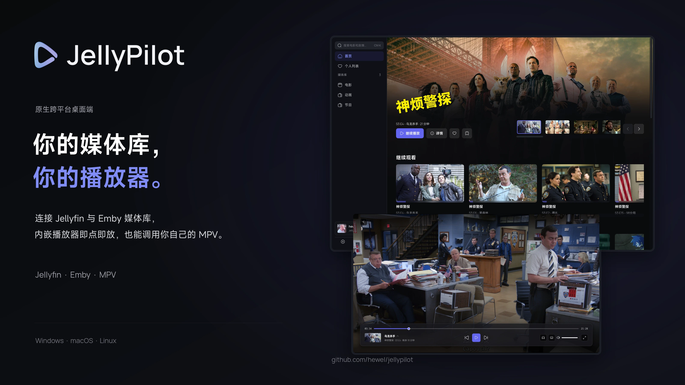
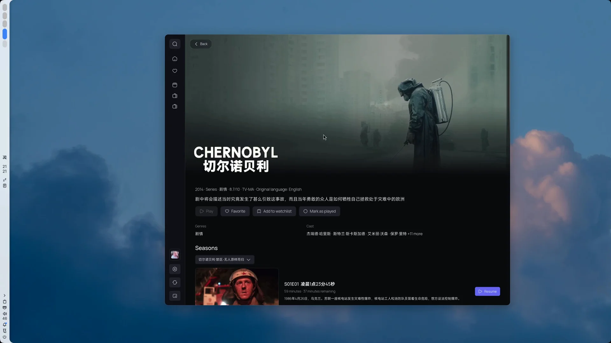
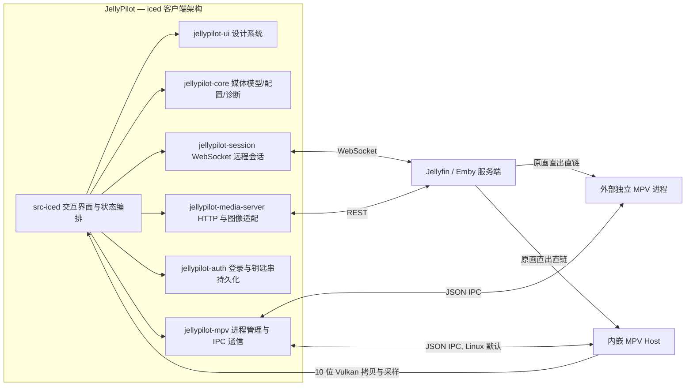

<div align="center">



# JellyPilot

[](https://github.com/hewel/jellypilot/actions/workflows/ci.yml)
[](https://www.rust-lang.org/)
[](https://iced.rs/)
[](LICENSE)

[English](README.md) · **简体中文**

**Jellyfin 与 Emby 的原生桌面客户端 — 真正的 MPV 播放，无 Electron、无 WebView、无强制转码。**

采用安全 Rust 与 [iced](https://iced.rs/) 纯原生绘制：轻量、跨平台、响应迅速。Linux 默认通过内嵌 MPV Fork 渲染；Windows 与 macOS 驱动你自己的 MPV。始终原画直连，Direct Play。

</div>

---

## 🎥 演示

<a href="assets/promo/demo.webm">
  
</a>

<p align="center"><sub>▶ 观看 65 秒演示：启动 → 浏览 → 剧集详情 → 内嵌 MPV 播放与悬浮控制。</sub></p>

## 📖 概览

**JellyPilot** 是 [Jellyfin](https://jellyfin.org/) 与 [Emby](https://emby.media/) 的原生桌面客户端：完整的媒体库浏览器、播放器与投屏接收端，而非网页界面的套壳。原生界面与真正的 MPV 播放，无浏览器。

- **🖥️ 完整桌面客户端，而非套壳网页**：浏览电影与剧集、管理收藏 / 待播清单 / 观看历史、多服务器多账号秒切——全部运行在快速的原生绘制界面中。
- **🎬 内嵌 MPV 播放（Linux 默认）**：项目专用的 host 增强版 mpv fork 直接在播放窗口内渲染——10 位 Vulkan 表面、原生 VAAPI 硬件解码、杜比视界 Profile 5 SDR 色调映射——悬浮控制一应俱全，与系统 MPV 配置完全隔离。
- **🚀 外部 MPV 播放（Windows 与 macOS 默认，Linux 可选）**：通过 JSON IPC 驱动独立 MPV 进程。您的 `mpv.conf`、GLSL 着色器、输入脚本与配置文件完整生效。
- **📺 投屏接收与远程控制**：在局域网内被 Jellyfin 客户端自动发现为原生投屏目标；播放指令、进度与轨道切换在主窗口、播放条与系统托盘之间双向同步。

## 🖼️ 界面预览

### 完整媒体库与播放控制

<a href="assets/screenshots/readme-home.webp">
  
</a>

<p align="center"><sub>深色模式 · 首页与播放控制条</sub></p>

### 媒体库浏览

<a href="assets/screenshots/readme-library.webp">
  
</a>

<p align="center"><sub>深色模式 · 媒体库与过滤筛选</sub></p>

### 内嵌播放器

<a href="assets/screenshots/readme-player.webp">
  
</a>

<p align="center"><sub>内嵌 MPV 播放 · 悬浮交互控制与轨道选择</sub></p>

## ✨ 功能特性

| 特性 | 说明 |
| :--- | :--- |
| 🎞️ **多服务器与账号管理** | 完整支持 Jellyfin 与 Emby，支持保存多服务器配置、钥匙串加密存储、Quick Connect 快捷登录与侧边栏无缝切换账号 |
| 📚 **流畅浏览与个人列表** | 电影与剧集分类索引、实时过滤、海报网格与按需缓存；完整集成账号隔离的待播清单（Watchlist）、收藏夹与详细观看历史 |
| 🎬 **双模式 MPV 原画播放引擎** | Linux 默认内嵌播放（10 位 Vulkan 表面、原生 VAAPI 硬解与杜比视界 Profile 5 色彩校正）；Windows/macOS 默认外部播放（JSON IPC 调度，完整兼容个人配置、着色器与脚本） |
| ⏭️ **沉浸追剧与智能控制** | 内置当季剧集抽屉秒切、自动/手动片头片尾跳过、分季音量自动记忆、自动连播切集，搭配响应式悬浮控制栏与自定义快捷键 |
| 💬 **多音轨与外挂字幕** | 自动挂载服务端外挂字幕，支持多音轨/多字幕自由切换，并可配置首选语言偏好排序 |
| 📺 **投屏接收与跨端协同** | 作为局域网 Jellyfin 投屏接收端；双向同步服务端远程控制指令、播放进度与系统托盘菜单，支持常驻后台 |
| 🎨 **精心设计的原生界面** | 优雅的深浅色主题、Title Logo 封面大图与背景虚化；支持中英双语即时切换，并提供专注轻量播控的「纯控模式」 |
| 🍏 **纯粹原生与就地诊断** | 基于 100% 纯安全 Rust 与 iced 构建，零 Web 技术低资源开销；内置运行事件诊断、MPV 原生通信日志捕获与一键脱敏导出 |

## 🧩 服务器支持

| 服务器 | 支持状态 | 具备能力 |
| :--- | :---: | :--- |
| **Jellyfin** | ✅ | 密码登录、快速连接（Quick Connect）、多账号保存与切换、媒体库索引、个人列表（收藏/待播清单/观看历史）、用户数据操作、内嵌与外部 MPV 播放、投屏设备注册、远程遥控、原生片头跳过 |
| **Emby** | ✅ | 密码登录、多账号保存与切换、媒体库索引、个人列表（收藏/待播清单/观看历史）、用户数据操作、内嵌与外部 MPV 播放、远程遥控、播放进度同步上报 |

Emby 在兼容接口上复用相同的媒体库、个人列表与播放管理逻辑；Jellyfin 专有的 Quick Connect 与片头跳过功能不会在 Emby 连接下显示。

### 适配 Jellyfin 12+
- **免开启旧版鉴权**：JellyPilot 原生采用标准 HTTP `Authorization` 头进行 API 请求，并在流媒体播放、字幕分发与 WebSocket 远程会话中使用 `ApiKey` 参数，完全兼容移除了旧版查询鉴权的 Jellyfin 12。现代 `ApiKey` 凭据在导出的诊断包中会自动脱敏。
- **基准地址与反向代理**：输入服务器地址时请填写包含反向代理前缀的真实完整路径；Jellyfin 12 已废弃旧有的 `/emby` 和 `/mediabrowser` 自动路径别名。
- **原生媒体标记（Intro Skipper）**：直接接入 Jellyfin 原生 Media Segments 数据结构（可由插件或服务端排程任务生成），独立判定片头与片尾区间，支持「自动跳过」、「手动提示」与「关闭」三种策略。若服务端未提供标记片段，播放将照常进行而不受影响。

## 🗺️ 路线图

- [ ] **Linux MPRIS 支持** — 对接 Linux 桌面多媒体控制协议（媒体按键与系统部件）

## 🚀 快速上手

### 运行环境要求

- **内嵌播放模式（Linux 默认）**：需要 host 增强版 `libmpv` 与配套基线配置（安装预打包版本时自动包含，或通过构建任务生成），以及支持 `Rgb10a2Unorm` 交换链格式的 Vulkan 显卡驱动。缺少环境依赖将显示明确错误，不会盲目退回未经验证的模式。
- **外部播放模式（Windows & macOS 默认，Linux 可选）**：需要系统已安装带 Lua 脚本支持的 [MPV](https://mpv.io/)（可在终端直接调用，或在**设置 → 播放**中指定绝对路径）。应用内置 Lua 钩子会在播放结束前保存并同步音量与静音状态。

### 安装指南

#### Linux

所有预打包的 Linux 发行版均已自带编译好的专有 mpv fork 动态库（`/usr/lib/jellypilot/libmpv.so`）与基线配置文件（`/usr/share/jellypilot/mpv-baseline.conf`），开箱即默认启动**内嵌 MPV 播放**。外部 MPV 依然可在设置中随时启用。

##### Arch Linux
通过 AUR 安装：

```bash
# 推荐安装预编译包
paru -S jellypilot-bin

# 或通过 AUR 本地编译源码
paru -S jellypilot
```
> 两款软件包相互冲突，任选其一即可。

##### Debian / Ubuntu (.deb)
从 [GitHub Releases](https://github.com/hewel/jellypilot/releases) 下载最新的 `jellypilot_*_amd64.deb`，使用包管理器安装：

```bash
sudo apt install ./jellypilot_*_amd64.deb
```
该 Deb 包自动携带内嵌 mpv 库并声明了完整的运行时库依赖。

##### 通用 Linux (AppImage)
从 [GitHub Releases](https://github.com/hewel/jellypilot/releases) 下载单文件 `jellypilot-*-x86_64.AppImage`，赋予执行权限后直接启动：

```bash
chmod +x jellypilot-*-x86_64.AppImage
./jellypilot-*-x86_64.AppImage
```

#### Windows
从 [GitHub Releases](https://github.com/hewel/jellypilot/releases) 下载 `jellypilot-*-setup.exe` 并运行安装程序。

> [!NOTE]
> Windows 默认采用**外部 MPV 播放**。请确保系统已安装 [MPV](https://mpv.io/) 并添加至环境变量 `PATH`，或在**设置 → 播放**中指定 MPV 可执行程序路径。

#### macOS
从 [GitHub Releases](https://github.com/hewel/jellypilot/releases) 下载 `jellypilot-*.dmg`，挂载后将 JellyPilot 拖移至 Applications 应用程序目录即可。

> [!NOTE]
> macOS 默认采用**外部 MPV 播放**。请确保已安装 MPV（例如通过 `brew install mpv`）并加入环境变量，或在**设置 → 播放**中设置其路径。

#### 源码构建

<details>
<summary>开发编译依赖</summary>

- [Rust](https://rustup.rs/) 1.98 或更高版本
- [Bun](https://bun.sh/) 1.3.14 或更高版本（仅用于任务调度器，本项目无 JavaScript 前端）
- Linux 原生图形依赖：GTK 3、`libxkbcommon` 与 Wayland 开发包（`libgtk-3-dev`、`libxkbcommon-dev`、`libwayland-dev`、`wayland-protocols`）
- Linux 内嵌 MPV 构建依赖（若仅使用外部 MPV 则可跳过）：Meson >= 1.3、Ninja、C/C++ 编译器、pkg-config、Vulkan 开发头文件与加载器、FFmpeg 开发库、`libplacebo` >= 7.360.1、`libass`。

</details>

```bash
git clone https://github.com/hewel/jellypilot.git
cd jellypilot
bun install --frozen-lockfile

# 可选（仅 Linux）：编译并部署内嵌 MPV Fork
bun run task mpv build

# 编译 release 正式版启动器
bun run task iced build --release
```

编译产物位于 `target/release/jellypilot`。

Cargo 任务会自动拉取并配置官方维护的 `target/vendor/iced` 专有 Fork 分支。`tools/embedded-mpv/iced-source.json` 是所引用的 Fork 版本权威来源。若要使用本地已有的 iced 源码：

```bash
bun run task iced prepare --source /absolute/path/to/iced
```

### 内嵌 MPV：构建、配置与恢复

这项正式落地的集成更新了 ADR 0027 早期对外部播放的限制，同时贯彻了原生 iced 无网页外壳的架构决策。Linux 平台默认采用内嵌 MPV 播放，已有旧配置会自动平滑迁移至内嵌模式。Windows 与 macOS 继续维持外部播放。在**设置 → 播放**中，若您偏好独立进程、个人着色器及配置，可切换回外部 MPV 并重启生效。浏览媒体库时点击「显示视频」可重新呼出播放画幅。内嵌与外部模式共享一套播放状态、队列、音量及远程控制流。

内嵌播放器在窗口化与全屏下均使用全窗口视频表面与悬浮控件，始终保持原片画幅比例且不裁剪：

| 快捷键 | 内嵌播放器响应操作 |
|---|---|
| 左 / 右箭头 | 快退 / 快进 5 秒（长按连续触发） |
| 上 / 下箭头 | 音量 +5% / −5%（限制在 0–100%，长按连续触发） |
| F | 切换全屏（忽略长按重复） |
| Esc | 退出全屏（若有展开的菜单或弹窗优先退出菜单） |
| 空格 / 单击画面 | 切换暂停与播放（空格忽略长按重复） |
| 返回按钮 | 停止播放，退出全屏并返回进入前的页面 |

这些按键仅在内嵌播放器处于激活状态时生效，不会干扰媒体库浏览。弹窗、菜单与快捷键录制优先截获输入。播放时鼠标光标在移动后重新显现，并在静止 3 秒后自动隐藏。光标滑至底部操作区（包含上方 48px 接近带）时唤起控制栏；在画面中央晃动不会打扰观影。左上角返回按钮拥有独立的悬浮感应区与 3 秒隐藏延时。暂停、拖拽进度条、展开菜单或片头跳过提示常驻时，控制栏保持显示。

```bash
# Linux 构建前置：Meson >=1.3, Ninja, C/C++ 编译器, pkg-config,
# Vulkan 开发头文件/loader, FFmpeg, libplacebo >=7.360.1, libass.
bun run task mpv build --source /absolute/path/to/mpv
bun run task iced run
```

`tools/embedded-mpv/source.json` 定义了 mpv 的固定修订版本、基线配置与 Meson 构建参数。若未传 `--source` 参数，构建任务会自动拉取锁定的 Fork 提交版本。构建任务将产物部署至 `target/embedded-mpv/lib/jellypilot/libmpv.so` 与 `target/embedded-mpv/share/jellypilot/mpv-baseline.conf`，并生成 `manifest.json` 记录构建环境指纹。

本地开发运行时会优先加载暂存目录下的内嵌组件；亦支持通过 `JELLYPILOT_LIBMPV` 与 `JELLYPILOT_MPV_BASELINE` 环境变量覆盖。打包后的可执行文件会按相对路径自动加载附带的动态库。当硬件与驱动支持时，内嵌播放器通过共享 Vulkan 设备的 DMA-BUF 拓展实现原生 VAAPI 视频硬解。

### Fork 维护与联合验收

JellyPilot 将自身代码提交、`Cargo.lock`、`tools/embedded-mpv/iced-source.json` 与 `tools/embedded-mpv/source.json` 视为强锁定的整体组合。

针对上游同步流程：
1. 在全新的应用检出中执行 `bun install --frozen-lockfile` 与 `bun run task iced prepare`（不加 `--source`），校验 iced Fork 拉取。
2. 运行 `bun run task mpv build` 编译锁定的 mpv 版本并生成 manifest。
3. 执行 `bun run task iced regress all --file /absolute/path/to/real-moving-clip.mp4` 进行全链路端到端原生回归探测。
4. 完成独立的人工三路色彩对比。

### 手动三路色彩对比规范

这是纯人工核验协议，完全独立于自动化生命周期探测：
对比对象固定为：**上一个已验收的原生 mpv / 候选原生 mpv / 候选内嵌 JellyPilot**。

针对 **SDR**、**HDR10** 与 **Dolby Vision Profile 5** 样本：
- 选取授权的真实测试样片，记录哈希与 ffprobe 详细色彩元数据。
- 固定并在三者中使用一致的帧时间戳、物理呈现尺寸、显示器环境与基础配置。
- 人工仔细校验肤色、中性灰、暗部细节、高光裁切、饱和度与色彩过渡，记录客观观测结果。

### 使用流程

1. 从启动器或终端**打开 JellyPilot**。
2. 在登录界面**选择服务器类型**：Jellyfin 或 Emby。
3. 输入服务器 URL 与凭据**完成身份验证**；Jellyfin 还支持便捷的 Quick Connect。
4. **账号便捷管理**：在侧边栏账户菜单中添加多服务器账号，随时无缝秒切。
5. **浏览与整理**：通过实时筛选查找影视剧集，管理个人待播清单、收藏夹与详细观看历史。
6. **即刻开播或投屏**：在 JellyPilot 中直接启播，或在其他客户端中点选「JellyPilot」进行投屏。
7. **全方位播控**：支持响应式悬浮控制栏、键盘快捷键、底部控制条、系统托盘及远程遥控会话。在剧集抽屉中点击即可秒跳当季任意单集。
8. **切换操作模式**：在设置中可自由切换「完整媒体库模式」与精简的「纯控模式（Control-Only）」。

**分季音量记忆**在**设置 → 播放**中默认开启。播放器会按设备、服务器和账号维度持久化保存当前剧季的音量设定，并在下一次播放该季时自动恢复，避免反复手动调节。

**就地诊断与播放日志**位于**设置 → 诊断**。开启「捕获播放日志」可在复现异常时记录底层 MPV 的完整通信与解码日志，并支持一键导出包含脱敏系统信息的支持日志包。

## 🏗️ 架构设计

单一 Rust 工作区：`jellypilot-ui` 负责定制 iced 表现层，领域逻辑与底层架构包保持无显示依赖并由测试全面覆盖。



- `src-iced` — 主应用程序：应用外壳、各页面视图、系统托盘、异步订阅、状态管理以及内嵌渲染器组件。
- `crates/jellypilot-launcher` — 入口启动器二进制，封装受信任的底层图形表面与引擎初始化接驳。
- `crates/jellypilot-mpv-host` — Linux 宿主 ABI，管理常驻 Vulkan 设备、DMA-BUF 硬解扩展接入及 10 位 GPU 纹理拷贝生命周期。
- `crates/jellypilot-ui` — 设计系统：设计令牌、Catalog 风格、定制组件、弹窗层与 Reicon 图标集。
- `crates/jellypilot-core` — 核心领域逻辑：媒体浏览模型、个人列表、应用配置、请求节流、诊断总线与海报按需加载规划。
- `crates/jellypilot-media-server` — 媒体服务器 HTTP 客户端适配层，基于生成的 OpenAPI 客户端构建。
- `crates/media-server-api` — 针对 Jellyfin 与 Emby API 生成的类型化 OpenAPI 客户端。
- `crates/jellypilot-auth` — 登录流程封装与操作系统钥匙串凭据管理。
- `crates/jellypilot-mpv` — MPV 进程生命周期控制、JSON IPC 协议通信与播放日志收集。
- `crates/jellypilot-session` — 媒体服务器 WebSocket 遥控与状态同步会话。

## 💻 本地开发

### 常用指令

| 任务 | 命令 |
| :--- | :--- |
| **启动开发模式** | `bun run task iced run` |
| **无头启动冒烟测试** | `xvfb-run -a bun run task iced run --smoke` |
| **编译 Release 正式版** | `bun run task iced build --release` |
| **编译内嵌 MPV（Linux）** | `bun run task mpv build` |
| **原生回归测试探测** | `bun run task iced regress all --file <样片路径>` |
| **执行全局规范检查** | `bun run check` |
| **格式化代码** | `bun run task rust fmt && bun run task fmt` |
| **运行 Rust 单元测试** | `bun run task rust test` |
| **运行 Clippy 代码检查** | `bun run task rust clippy` |
| **重新生成 API 客户端** | `bun run task api` |

### 编码规范

- **Rust 格式与安全**：必须符合 `rustfmt.toml`（2 空格缩进）；整个工作区严禁使用 `unsafe_code`（仅在极少数受控底层 FFI 模块中隔离）；Clippy 告警视为编译错误。
- **无 UI 领域逻辑下沉**：纯逻辑与数据处理下沉至 `jellypilot-core` 并在其内部配套完善测试；`src-iced` 仅负责界面渲染与事件编排。
- **领域通用语言**：术语遵循 [CONTEXT.md](CONTEXT.md)；架构变更记录于 [docs/adr/](docs/adr/)。

## 📜 项目演进历史

1.4.x 及更早版本基于 Tauri 与 Solid.js 构建，内置基于 Web 技术的播放器与本地 FFmpeg HLS 转码管道。该技术栈已依据 [ADR 0027](docs/adr/0027-cross-platform-iced-frontend.md) 完全淘汰。自 [ADR 0040](docs/adr/0040-linux-embedded-mpv-default.md) 起，Linux 平台默认全面启用专有内嵌 MPV 渲染；历史旧版本数据与配置不再沿用。

## 🙏 致谢

- [MPV](https://mpv.io/) — 世界上最卓越的多媒体播放引擎。
- [iced](https://iced.rs/) — 支撑本项目精美界面的跨平台纯 Rust 原生 GUI 库。
- [Jellyfin](https://jellyfin.org/) 与 [Emby](https://emby.media/) — 为数字媒体而生的优秀媒体服务器。
