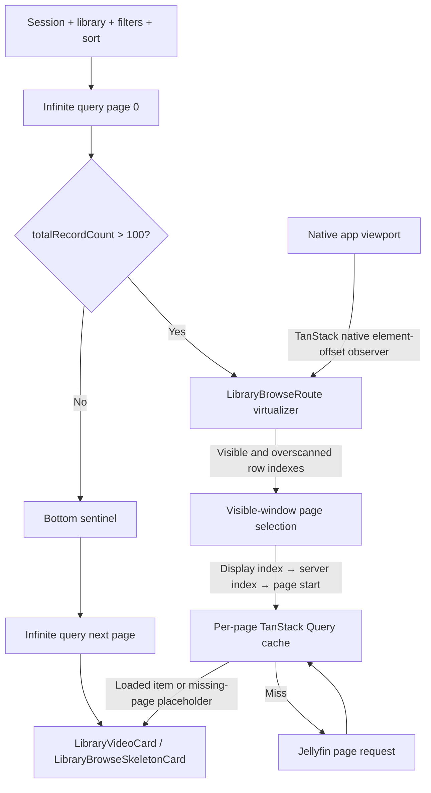

# Library Virtual Scrolling

This document describes the virtualized grid used by the movie and TV library browse route:

- route and paging: `src/routes/_authenticated/library/$collectionType/$libraryId.tsx`
- shared layout math: `src/utils/libraryBrowseLayout.ts`
- page selection math: `src/utils/libraryBrowsePageSelection.ts`
- rendered regressions: `tests/app-shell.test.tsx`
- layout math tests: `tests/library-browse-layout.test.ts`
- page selection tests: `tests/library-browse-page-selection.test.ts`
- native WebView regression: `e2e/specs/library-virtual-scroll.e2e.ts`

## Why the grid is virtualized

Libraries with more than 100 records render only the rows near the native application viewport.
Smaller libraries keep the normal grid and infinite-load sentinel. The threshold avoids paying the
virtualizer's lifecycle and geometry costs when the full result set is already small.

The first successful server page supplies `totalRecordCount`, so every browse begins through the
same `createInfiniteQuery` bootstrap before choosing one of two continuation strategies:

| Result size           | Rendering             | Page continuation                                                            |
| --------------------- | --------------------- | ---------------------------------------------------------------------------- |
| 100 records or fewer  | Normal CSS grid       | `createInfiniteQuery.fetchNextPage()` through the bottom sentinel            |
| More than 100 records | TanStack virtual rows | Random-access `fetchQuery()` calls for pages intersecting the virtual window |

Removing virtualization made the reported whole-card flash disappear. The implementation therefore
has one critical invariant: a large wheel or programmatic scroll jump must always leave rendered rows
covering the viewport. A temporarily empty virtual window is a visible full-card flash.

## Ownership and data flow

`LibraryBrowseRoute` owns the TanStack virtualizer, server data, grid measurements, and page
selection. Keeping the virtualizer at the stable route lifecycle prevents cached data from creating
a second, late lifecycle boundary.



### Query identity and Effect boundary

The browse query key contains the connection/session identity, collection type, library ID, sort
field, played filter, favorites filter, and sort direction. Changing any of them creates a distinct
TanStack Query result and changes the route's serialized browse-query signature.

The infinite query starts with `pageParam: 0`. Each query function passes the numeric page parameter
to `fetchVideoLibraryPage()`, which requests `LIBRARY_BROWSE_PAGE_SIZE` records (currently 24).
`getNextPageParam` advances to `page.startIndex + page.limit` only when the returned `Exit` is
successful and `page.hasMore` is true.

`fetchVideoLibraryPage()` is an Effect workflow and `runExit()` executes it at the route boundary.
Command failures therefore arrive as `Exit.Failure` query data rather than rejected TanStack Query
promises. The route uses `Exit.isSuccess` and `Exit.match` to decide whether it can render, continue
paging, or expose a retry.

## Scroll observation

The virtualizer does not provide a custom `observeElementOffset`. The Solid adapter therefore uses
TanStack Virtual's native element-offset observer directly on the shared application viewport. This
keeps scroll event timing and `isScrolling` state inside TanStack instead of translating the
application scroll context through a second subscription and timer.

The route still supplies `observeElementRect`. Its only customization is replacing zero width or
height values with measured fallbacks. This is required by the JSDOM test environment and protects
initial native layout before `ResizeObserver` has reported useful dimensions.

### Cached route lifecycle

Cached data can make the virtual grid ready before the root scroll viewport finishes mounting. The
virtualizer therefore uses TanStack's public `enabled` option and becomes active only when all three
conditions are true:

- the Solid route has mounted;
- the result set exceeds the virtualization threshold;
- `appScroll.viewport()` contains the shared native scroll element.

The false-to-true `enabled` transition lets the Solid adapter attach its observers through its normal
lifecycle. Route code must not call TanStack's underscore-prefixed `_didMount()` or `_willUpdate()`
methods.

## Geometry

The parent route observes both the grid and the scroll viewport with `ResizeObserver`.
`measureVirtualGrid()` maintains:

- `virtualGridWidth`, used to calculate column count and estimated card-row height;
- `virtualViewportHeight`, used to calculate adaptive overscan;
- `virtualScrollMargin`, the grid's document offset inside the shared scroll viewport.

The row height estimate mirrors the grid and card styles:

```text
card width =
  (grid width - column gaps) / column count

row height =
  poster height at 1.5 aspect ratio
  + 2px card borders
  + 16px grid row gap
```

Each virtual row is absolutely positioned at:

```text
virtual row start - virtual scroll margin
```

The margin matters because the library grid is not at scroll offset zero; navigation and route
content appear above it.

### Persistent grid visibility

The virtual-grid root must not use the route's `fadeIn` entrance animation. Chromium can restart that
animation on the same root node when a large scroll replaces the rendered row window. Because
`fadeIn` begins at zero opacity, the restart hides every virtual row for one or more frames even
though the canvas still contains rows. The normal, non-virtual grid may keep its one-time entrance
animation.

## Adaptive overscan

`libraryBrowseVirtualOverscanRows(viewportHeight, rowHeight)` computes:

```text
visible rows = ceil(viewport height / estimated row height)
overscan rows = clamp(visible rows * 2, 6, 18)
```

TanStack applies `overscan` outside the visible range, so this retains roughly two viewport-heights
of rows on each available side, with a minimum of six and a maximum of eighteen rows. The larger
window absorbs high-delta wheel events and large scroll jumps without allowing the rendered DOM to
grow without bound. Invalid or unavailable geometry falls back to six rows.

## Server paging

### Infinite-query bootstrap and cache bridge

The infinite query always owns page 0. For a small result set it continues to own every later page,
flattens the successful pages, and renders them in the normal grid. For a virtual result set it
primarily establishes the first records and `totalRecordCount`; the visible-window path then loads
non-contiguous pages directly.

Every successful infinite-query page is copied into a per-page TanStack Query entry keyed by the
complete browse identity plus `["page", startIndex]`. `successfulPageMap` merges those infinite-query
pages with route-local virtual pages by server `startIndex`. This gives item rendering one
random-access page map regardless of which path loaded a page and lets cached route re-entry reuse
successful page data.

### Visible row to server page

The virtualizer reports visible and overscanned row indexes to the parent route. The display-index
translation and page grouping live in the pure, framework-independent utility
`src/utils/libraryBrowsePageSelection.ts`, which has no Solid, TanStack, Effect, or Tauri
dependency:

- `libraryBrowsePageLocationForDisplayIndex({ displayIndex, totalRecordCount, pageSize, reverse })`
  maps one display index to its server page start and offset within that page, returning `null`
  for invalid or out-of-range input;
- `libraryBrowsePageStartsForRows({ rowIndexes, columnCount, totalRecordCount, pageSize, reverse })`
  expands virtual row indexes into the deduplicated required page starts in row/display encounter
  order and appends one direction-aware speculative look-ahead page last.

The planner expands each row into its column display indexes:

```text
display index = virtual row index × column count + column index
```

Normal display order uses the display index as the server index. Reverse display order maps across
the complete result set:

```text
server index = total record count - 1 - display index
```

The planner then groups server indexes into 24-record page starts:

```text
page start =
  floor(server index / LIBRARY_BROWSE_PAGE_SIZE)
  × LIBRARY_BROWSE_PAGE_SIZE
```

This global index translation lets reverse order jump directly to a page near the end of the server
result without downloading every preceding page. Because page boundaries and grid rows need not
align, one virtual row can require records from two server pages.

The page window also includes one speculative look-ahead page when one exists. Before requesting
the network, `fetchVirtualPage` checks:

1. pages already loaded by the initial infinite query;
2. pages already installed in the route-local virtual page map;
3. page requests already in flight;
4. the TanStack Query cache, including cached route re-entry data.

The look-ahead follows the display order toward the visual end of the result:

```text
normal order: max(required page starts) + LIBRARY_BROWSE_PAGE_SIZE
reverse order: min(required page starts) - LIBRARY_BROWSE_PAGE_SIZE
```

Normal order prefetches toward higher server page starts and reverse order prefetches toward lower
ones. `libraryBrowsePageStartsForRows` omits the speculative page when it falls outside the valid
server page range or duplicates a required page, and it always appends it after every required
page, so visible pages stay prioritized ahead of the prefetch. This is a fixed display-order policy,
not dynamic prediction of the user's current scroll direction.

Before a network request starts, the route captures the current browse-query signature. Completion
installs the page only when that signature still matches, so a request from an old library, session,
sort, or filter cannot populate the new result set. Virtual page fetching is also gated until the
current infinite-query first page is a successful page whose `startIndex` is zero. This ensures page
0 settles before preserved or newly measured scroll geometry can request later pages.

Missing items render `LibraryBrowseSkeletonCard` in their stable grid slot. Successful pages replace
those placeholders without changing the virtual canvas geometry.

When filters, sorting, library, or connection identity changes, the browse query signature changes.
The route clears its virtual-page state and scrolls the shared viewport to the top so page data from
the previous result set cannot be displayed at the new virtual position.

### Small-result sentinel paging

The bottom sentinel uses `IntersectionObserver` with a 400px vertical root margin. When it approaches
the viewport, the route calls `fetchNextPage({ cancelRefetch: false })` only when:

- virtual mode is inactive;
- the infinite query has another page;
- no query fetch is active;
- no later infinite-query page has failed.

While the next page is loading, the normal grid appends skeleton cards. The sentinel remains in the
virtual route markup, but its effect explicitly stops when virtual mode is active.

### Failure and retry paths

A failed first page renders the route status panel and cannot start virtual paging. Later failures
are handled according to the active continuation strategy:

- for a small result set, retry removes the failed page and matching page parameter from the
  infinite-query cache, then calls `fetchNextPage()` again;
- for a virtual result set, retry removes failed route-local page entries and requests the pages
  required by the current virtual window again.

Failed pages stay as typed `Exit.Failure` values until the route translates their causes into the
load-more error panel. They are not treated as successful empty pages.

## Regression coverage

The focused tests protect different boundaries:

- `tests/library-browse-layout.test.ts` checks adaptive overscan and its safe bounds.
- `tests/library-browse-page-selection.test.ts` checks the pure display-to-page locations, the
  encounter-order page planner, and the direction-aware look-ahead boundaries.
- `tests/app-shell.test.tsx` makes several large forward and backward jumps, observes the canvas for
  empty child windows, samples immediately, after the mutation microtask, and on the first animation
  frame, asserts that the persistent virtual root has no entrance-animation class, checks end-of-list
  paging, and covers cached route re-entry.
- `e2e/specs/library-virtual-scroll.e2e.ts` runs in the controlled native Tauri WebView, performs the
  same class of jumps on the real shared viewport, observes child-list mutations, and checks at the
  microtask, first-frame, and settled-frame boundaries that a rendered row intersects the viewport.

When changing this code, run at least:

```bash
bun run test -- tests/library-browse-layout.test.ts tests/library-browse-page-selection.test.ts tests/app-shell.test.tsx
bun run typecheck:e2e
bun run build:e2e
bun run test:e2e --spec e2e/specs/library-virtual-scroll.e2e.ts
git diff --check
```

Use the native E2E result as the runtime boundary. JellyPilot runs in Tauri/WebKit, so a localhost
browser is not authoritative for scroll timing or WebView rendering behavior.

## Change checklist

Before merging a virtual-scroll change, confirm:

- the virtualizer still uses TanStack's native element-offset observer;
- the virtualizer remains disabled until Solid has mounted and the shared viewport exists;
- the canvas height represents every server record, including unloaded pages;
- every sampled scroll position has at least one row intersecting the viewport;
- the persistent virtual-grid root has no entrance or opacity animation;
- adaptive overscan remains bounded;
- grid style changes are reflected in the shared row-height math;
- cached route re-entry still attaches the scroll observer;
- virtual paging does not start until a successful page 0 has settled;
- infinite-query pages continue to seed the per-page cache;
- reverse sorting requests the correct server page;
- normal and reverse look-ahead are tested as display-order behavior;
- native E2E passes in addition to DOM and helper tests.
