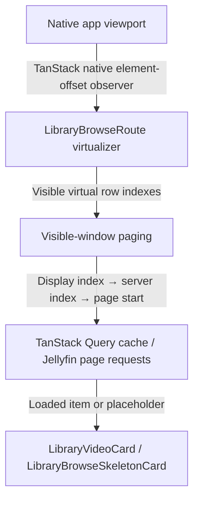

# Library Virtual Scrolling

This document describes the virtualized grid used by the movie and TV library browse route:

- route and paging: `src/routes/_authenticated/library/$collectionType/$libraryId.tsx`
- shared layout math: `src/utils/libraryBrowseLayout.ts`
- rendered regressions: `tests/app-shell.test.tsx`
- layout math tests: `tests/library-browse-layout.test.ts`
- native WebView regression: `e2e/specs/library-virtual-scroll.e2e.ts`

## Why the grid is virtualized

Libraries with more than 100 records render only the rows near the native application viewport.
Smaller libraries keep the normal grid and infinite-load sentinel. The threshold avoids paying the
virtualizer's lifecycle and geometry costs when the full result set is already small.

Removing virtualization made the reported whole-card flash disappear. The implementation therefore
has one critical invariant: a large wheel or programmatic scroll jump must always leave rendered rows
covering the viewport. A temporarily empty virtual window is a visible full-card flash.

## Ownership and data flow

`LibraryBrowseRoute` owns the TanStack virtualizer, server data, grid measurements, and page
selection. Keeping the virtualizer at the stable route lifecycle prevents cached data from creating
a second, late lifecycle boundary.



## Scroll observation

The virtualizer does not provide a custom `observeElementOffset`. The Solid adapter therefore uses
TanStack Virtual's native element-offset observer directly on the shared application viewport. This
keeps scroll event timing and `isScrolling` state inside TanStack instead of translating the
application scroll context through a second subscription and timer.

The route still supplies `observeElementRect`. Its only customization is replacing zero width or
height values with measured fallbacks. This is required by the JSDOM test environment and protects
initial native layout before `ResizeObserver` has reported useful dimensions.

### Cached route lifecycle

Cached data can make the virtual grid ready before the root scroll viewport finishes mounting. The
virtualizer therefore uses TanStack's public `enabled` option and becomes active only when all three
conditions are true:

- the Solid route has mounted;
- the result set exceeds the virtualization threshold;
- `appScroll.viewport()` contains the shared native scroll element.

The false-to-true `enabled` transition lets the Solid adapter attach its observers through its normal
lifecycle. Route code must not call TanStack's underscore-prefixed `_didMount()` or `_willUpdate()`
methods.

## Geometry

The parent route observes both the grid and the scroll viewport with `ResizeObserver`.
`measureVirtualGrid()` maintains:

- `virtualGridWidth`, used to calculate column count and estimated card-row height;
- `virtualViewportHeight`, used to calculate adaptive overscan;
- `virtualScrollMargin`, the grid's document offset inside the shared scroll viewport.

The row height estimate mirrors the grid and card styles:

```text
card width =
  (grid width - column gaps) / column count

row height =
  poster height at 1.5 aspect ratio
  + 2px card borders
  + 16px grid row gap
```

Each virtual row is absolutely positioned at:

```text
virtual row start - virtual scroll margin
```

The margin matters because the library grid is not at scroll offset zero; navigation and route
content appear above it.

### Persistent grid visibility

The virtual-grid root must not use the route's `fadeIn` entrance animation. Chromium can restart that
animation on the same root node when a large scroll replaces the rendered row window. Because
`fadeIn` begins at zero opacity, the restart hides every virtual row for one or more frames even
though the canvas still contains rows. The normal, non-virtual grid may keep its one-time entrance
animation.

## Adaptive overscan

`libraryBrowseVirtualOverscanRows(viewportHeight, rowHeight)` computes:

```text
visible rows = ceil(viewport height / estimated row height)
overscan rows = clamp(visible rows * 2, 6, 18)
```

TanStack applies `overscan` outside the visible range, so this retains roughly two viewport-heights
of rows on each available side, with a minimum of six and a maximum of eighteen rows. The larger
window absorbs high-delta wheel events and large scroll jumps without allowing the rendered DOM to
grow without bound. Invalid or unavailable geometry falls back to six rows.

## Server paging

The virtualizer reports its current row indexes to the parent route. The parent expands every row
into column display indexes, translates those indexes for reverse sorting, and groups them into
server page starts using `LIBRARY_BROWSE_PAGE_SIZE`.

The page window includes one page beyond the highest visible page when one exists. Before requesting
the network, `fetchVirtualPage` checks:

1. pages already loaded by the initial infinite query;
2. pages already installed in the route-local virtual page map;
3. page requests already in flight;
4. the TanStack Query cache, including cached route re-entry data.

Missing items render `LibraryBrowseSkeletonCard` in their stable grid slot. Successful pages replace
those placeholders without changing the virtual canvas geometry.

When filters, sorting, library, or connection identity changes, the browse query signature changes.
The route clears its virtual-page state and scrolls the shared viewport to the top so page data from
the previous result set cannot be displayed at the new virtual position.

## Regression coverage

The focused tests protect different boundaries:

- `tests/library-browse-layout.test.ts` checks adaptive overscan and its safe bounds.
- `tests/app-shell.test.tsx` makes several large forward and backward jumps, observes the canvas for
  empty child windows, samples immediately, after the mutation microtask, and on the first animation
  frame, asserts that the persistent virtual root has no entrance-animation class, checks end-of-list
  paging, and covers cached route re-entry.
- `e2e/specs/library-virtual-scroll.e2e.ts` runs in the controlled native Tauri WebView, performs the
  same class of jumps on the real shared viewport, observes child-list mutations, and checks at the
  microtask, first-frame, and settled-frame boundaries that a rendered row intersects the viewport.

When changing this code, run at least:

```bash
bun run test -- tests/library-browse-layout.test.ts tests/app-shell.test.tsx
bun run typecheck:e2e
bun run build:e2e
bun run test:e2e --spec e2e/specs/library-virtual-scroll.e2e.ts
git diff --check
```

Use the native E2E result as the runtime boundary. JellyPilot runs in Tauri/WebKit, so a localhost
browser is not authoritative for scroll timing or WebView rendering behavior.

## Change checklist

Before merging a virtual-scroll change, confirm:

- the virtualizer still uses TanStack's native element-offset observer;
- the virtualizer remains disabled until Solid has mounted and the shared viewport exists;
- the canvas height represents every server record, including unloaded pages;
- every sampled scroll position has at least one row intersecting the viewport;
- the persistent virtual-grid root has no entrance or opacity animation;
- adaptive overscan remains bounded;
- grid style changes are reflected in the shared row-height math;
- cached route re-entry still attaches the scroll observer;
- reverse sorting requests the correct server page;
- native E2E passes in addition to DOM and helper tests.
