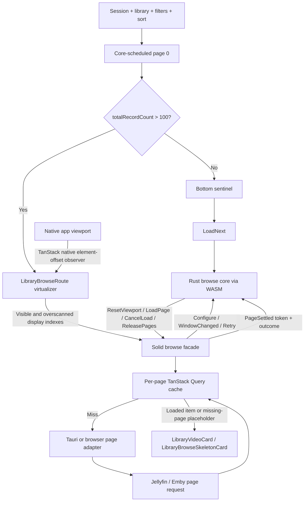

# Library Virtual Scrolling

This document describes the virtualized grid used by the movie and TV library browse route:

- route and paging: `src/routes/_authenticated/library/$collectionType/$libraryId.tsx`
- Solid browse facade: `src/utils/createLibraryBrowseWindow.ts`
- lazy WASM loader: `src/utils/libraryBrowseWasm.ts`
- portable browse policy: `crates/jellypilot-core`
- browser/WASM boundary: `crates/jellypilot-core-wasm`
- shared layout math: `src/utils/libraryBrowseLayout.ts`
- rendered regressions: `tests/app-shell.test.tsx`
- layout math tests: `tests/library-browse-layout.test.ts`
- native WebView regression: `e2e/specs/library-virtual-scroll.e2e.ts`

## Why the grid is virtualized

Libraries with more than 100 records render only the rows near the native application viewport.
Smaller libraries keep the normal grid and infinite-load sentinel. The threshold avoids paying the
virtualizer's lifecycle and geometry costs when the full result set is already small.

The first successful server page supplies `totalRecordCount`, so every browse begins with the same
core-scheduled page-zero load before choosing one of two continuation strategies:

| Result size           | Rendering             | Core input and continuation                              |
| --------------------- | --------------------- | -------------------------------------------------------- |
| 100 records or fewer  | Normal CSS grid       | Bottom sentinel sends `LoadNext`                         |
| More than 100 records | TanStack virtual rows | Visible display indexes are sent through `WindowChanged` |

Removing virtualization made the reported whole-card flash disappear. The implementation therefore
has one critical invariant: a large wheel or programmatic scroll jump must always leave rendered rows
covering the viewport. A temporarily empty virtual window is a visible full-card flash.

## Ownership and data flow

Browse behavior is split by kind of knowledge, not by runtime. The portable Rust core owns
metadata-only policy; the Solid facade owns browser lifecycle and data; provider adapters own wire
requests. Keeping the virtualizer at the stable route lifecycle prevents cached data from creating
a second, late lifecycle boundary.

| Layer             | Owns                                                                                                                                                                                     | Must not own                                                                       |
| ----------------- | ---------------------------------------------------------------------------------------------------------------------------------------------------------------------------------------- | ---------------------------------------------------------------------------------- |
| `jellypilot-core` | Browse generation, page-zero gating, mode, demanded-page planning, bounded prefetch, request tokens, deduplication, retry, stale completion rejection, slot metadata, and page retention | Media payloads, network calls, clocks, DOM geometry, rendering, or framework state |
| WASM wrapper      | `wasm-bindgen`/TypeScript DTO conversion and a browser-callable core handle                                                                                                              | Browse policy or environment-specific transport                                    |
| Solid facade      | Query identity inputs, actual page payloads/cache, command execution, virtualizer-to-display-index translation, and reactive view state                                                  | A second paging scheduler or page-ordering policy                                  |
| Route/UI          | Filters, persistence, controls, DOM measurements, columns, overscan, sentinel choice, skeletons, focus, and animations                                                                   | Provider query construction                                                        |
| Provider adapter  | Jellyfin/Emby request construction, authentication/session context, response mapping, and typed provider failures                                                                        | Display order emulation or viewport policy                                         |



### Browser and Tauri adapters

The shipped Tauri WebView and a normal browser use the same browser-targeted
`jellypilot_core_wasm` module. There is no per-scroll Tauri command and no second native copy of the
browse state machine behind IPC. Only the effect that satisfies `LoadPage` varies:

- in Tauri, the adapter calls the generated typed `libraryBrowseVideo` command;
- a normal browser host can provide an HTTP/authentication adapter with the same settle contract;
- unit and integration tests can provide an in-memory adapter.

The browser HTTP/authentication adapter is an extension seam, not permission to import transport
into the core. A future Rust-native UI links `jellypilot-core` directly instead of loading the WASM
wrapper.

### Query identity and Effect boundary

The browse source identity contains the connection/session identity, collection type, library ID, sort
field, played filter, favorites filter, and sort direction. Changing any of them creates a distinct
TanStack Query result and configures a new core generation. Completions carry request tokens; a
completion from an older generation cannot mutate the active browse state.

`Configure` establishes a new source generation. The core first emits `LoadPage` for start index zero
and `LIBRARY_BROWSE_PAGE_SIZE` records (currently 24). The adapter calls
`fetchVideoLibraryPage()` and returns the request token plus page metadata through `PageSettled`.
Successful metadata includes the returned start, count, total count, and whether more records exist;
item payloads stay in the UI cache.

`fetchVideoLibraryPage()` is an Effect workflow and `runExit()` executes it at the route boundary.
Command failures therefore arrive as `Exit.Failure` query data rather than rejected TanStack Query
promises. The route uses `Exit.isSuccess` and `Exit.match` to decide whether it can render, continue
paging, or expose a retry.

## Scroll observation

The virtualizer does not provide a custom `observeElementOffset`. The Solid adapter therefore uses
TanStack Virtual's native element-offset observer directly on the shared application viewport. This
keeps scroll event timing and `isScrolling` state inside TanStack instead of translating the
application scroll context through a second subscription and timer.

The route still supplies `observeElementRect`. Its only customization is replacing zero width or
height values with measured fallbacks. This is required by the JSDOM test environment and protects
initial native layout before `ResizeObserver` has reported useful dimensions.

### Cached route lifecycle

Cached data can make the virtual grid ready before the root scroll viewport finishes mounting. The
virtualizer therefore uses TanStack's public `enabled` option and becomes active only when all three
conditions are true:

- the Solid route has mounted;
- the result set exceeds the virtualization threshold;
- `appScroll.viewport()` contains the shared native scroll element.

The false-to-true `enabled` transition lets the Solid adapter attach its observers through its normal
lifecycle. Route code must not call TanStack's underscore-prefixed `_didMount()` or `_willUpdate()`
methods.

The WASM module is also lazy. The application does not initialize it during shell startup.
`src/utils/libraryBrowseWasm.ts` imports the generated `jellypilot_core_wasm` module on first Library
Browse entry and caches one module-level call to its default initializer. Each route entry then gets
its own `LibraryBrowseCore` instance. The route's existing loading state covers initialization, so no
core command is interpreted before the module is ready. If initialization rejects, the active route
uses its existing initial-error state and the loader clears the cached promise so a later Library
entry can retry.

`crates/jellypilot-core-wasm/pkg/` is ignored generated output from `wasm-pack`. Do not patch its
JavaScript or declarations. Regenerate it from the Rust wrapper whenever its exported DTO boundary
changes; builds and checks must generate it before TypeScript or Rsbuild consumes it.

The dispatcher pins `wasm-pack` 0.15.0. `bun run task wasm install` installs that exact version when
it is missing or mismatched. Use `bun run task wasm build --dev` for a debuggable module and
`bun run task wasm build --release` for production output; `bun run task wasm build` selects release
normally and development output for the WebDriver build. These commands run the equivalent of:

```bash
wasm-pack build crates/jellypilot-core-wasm \
  --target web \
  --out-dir pkg \
  --out-name jellypilot_core_wasm \
  --dev # or --release
```

The package entry is `pkg/jellypilot_core_wasm.js` plus its emitted `.wasm` payload and declarations.
The default export must initialize the module before callers use named exports. Rsbuild resolves the
emitted `.wasm` URL the same way for a normal browser and the Tauri WebView.

## Geometry

The parent route observes both the grid and the scroll viewport with `ResizeObserver`.
`measureVirtualGrid()` maintains:

- `virtualGridWidth`, used to calculate column count and estimated card-row height;
- `virtualViewportHeight`, used to calculate adaptive overscan;
- `virtualScrollMargin`, the grid's document offset inside the shared scroll viewport.

The row height estimate mirrors the grid and card styles:

```text
card width =
  (grid width - column gaps) / column count

row height =
  poster height at 1.5 aspect ratio
  + 2px card borders
  + 16px grid row gap
```

Each virtual row is absolutely positioned at:

```text
virtual row start - virtual scroll margin
```

The margin matters because the library grid is not at scroll offset zero; navigation and route
content appear above it.

### Persistent grid visibility

The virtual-grid root must not use the route's `fadeIn` entrance animation. Chromium can restart that
animation on the same root node when a large scroll replaces the rendered row window. Because
`fadeIn` begins at zero opacity, the restart hides every virtual row for one or more frames even
though the canvas still contains rows. The normal, non-virtual grid may keep its one-time entrance
animation.

## Adaptive overscan

`libraryBrowseVirtualOverscanRows(viewportHeight, rowHeight)` computes:

```text
visible rows = ceil(viewport height / estimated row height)
overscan rows = clamp(visible rows * 2, 6, 18)
```

TanStack applies `overscan` outside the visible range, so this retains roughly two viewport-heights
of rows on each available side, with a minimum of six and a maximum of eighteen rows. The larger
window absorbs high-delta wheel events and large scroll jumps without allowing the rendered DOM to
grow without bound. Invalid or unavailable geometry falls back to six rows.

## Server paging

### Core bootstrap and cache bridge

The core always owns page-zero scheduling. For a small result set, each `LoadNext` advances from the
settled page metadata and the Solid facade flattens successful cached pages into the normal grid. For
a virtual result set, `WindowChanged` lets the core schedule non-contiguous pages directly.

Every successful page is stored in a per-page TanStack Query entry keyed by the complete browse
identity plus `["page", startIndex]`. Item rendering reads one random-access page map regardless of
which core input demanded a page, and cached route re-entry can settle a new `LoadPage` from existing
data without repeating transport.

### Visible row to server page

The virtualizer reports visible and overscanned row indexes to the Solid facade. The facade expands
each row into display indexes because column count is DOM geometry and remains UI-owned:

```text
display index = virtual row index × column count + column index
```

The facade sends those indexes through `WindowChanged`. The core groups valid display indexes into
24-record page starts:

```text
page start =
  floor(display index / LIBRARY_BROWSE_PAGE_SIZE)
  × LIBRARY_BROWSE_PAGE_SIZE
```

Because sorting direction is sent to the server, display indexes and server result indexes have the
same order for both ascending and descending requests. The core does not mirror indexes or reverse
loaded page fragments. Page boundaries and grid rows still need not align, so one virtual row can
require records from two server pages.

The page window also includes one speculative look-ahead page when one exists. The core permits at
most two pending loads across bootstrap, visible, prefetch, sequential, and retry work. Before
emitting a `LoadPage`, it checks:

1. page metadata already settled for the active generation;
2. page requests already in flight;
3. the bounded request concurrency budget.

The Solid facade then checks the TanStack Query cache, including cached route re-entry data, before
executing a network request. Cache hits are returned to the core through the same `PageSettled`
input as transport results.

The look-ahead is the next higher server page because the server already applies the requested sort
direction. The core omits it when it falls outside the valid result range or duplicates a required
page, and emits visible-page loads before the speculative load. This is a fixed display-order
policy, not dynamic prediction of the user's current scroll direction.

Every `LoadPage` has a token tied to the active generation. `PageSettled` must echo that token, so a
request from an old library, session, sort, or filter cannot populate the new result set. The core
also gates nonzero pages until page zero settles successfully. This prevents preserved or newly
measured scroll geometry from starting later-page work before the total result shape is known.

A successful settlement is accepted only when its start and limit match the pending request, its
item count and `hasMore` agree with the total count, and every nonzero page reports the same total as
page zero. Malformed metadata becomes a non-retryable core failure instead of corrupting slot
addressing.

Missing items render `LibraryBrowseSkeletonCard` in their stable grid slot. Successful pages replace
those placeholders without changing the virtual canvas geometry.

When filters, sorting, library, or connection identity changes, the core emits `CancelLoad`,
`ReleasePages`, and `ResetViewport` as needed. The Solid facade executes them by cancelling adapter
work where supported, releasing pages from the active slot map, and scrolling the shared viewport to
the top. TanStack cache retention remains a UI policy, so released pages may still satisfy a later
route entry without transport.

### Server-side sorting

`VideoLibraryPageRequest` carries `sortDirection: "asc" | "desc"` independently from the selected
sort key. Jellyfin maps this to its generated `SortOrder::Ascending` or `SortOrder::Descending`; Emby
serializes `SortOrder=Ascending` or `SortOrder=Descending`. Start/limit normalization remains
unchanged.

This is required for globally correct pagination. Reversing only the pages currently loaded can
neither produce the global descending first page nor keep already rendered items stable as later
pages arrive. No UI adapter may use `toReversed()` or reverse page fragments to emulate descending
server order.

### Small-result sentinel paging

The bottom sentinel uses `IntersectionObserver` with a 400px vertical root margin. When it approaches
the viewport, the route sends `LoadNext` only when:

- virtual mode is inactive;
- the settled page metadata says another page exists;
- no sequential page request is active;
- no later page has failed.

While the next page is loading, the normal grid appends skeleton cards. The sentinel remains in the
virtual route markup, but its effect explicitly stops when virtual mode is active.

### Failure and retry paths

A failed first page renders the route status panel and cannot start later paging. Later failures are
handled according to the active continuation strategy:

- for a small result set, `Retry` reschedules the failed sequential page when it remains demanded;
- for a virtual result set, `Retry` asks the core to schedule failed pages that are still demanded by
  the active window.

Failed pages stay as typed `Exit.Failure` values until the route translates their causes into the
load-more error panel. They are not treated as successful empty pages.

## Regression coverage

The migration uses the following test matrix. Keep these lanes separate so a serializer test does
not stand in for a rendered or native regression; rows without a permanent filename are required
standalone coverage for that boundary rather than a claim that another lane already covers it:

| Boundary       | Required contracts                                                                                                               | Test lane                                   |
| -------------- | -------------------------------------------------------------------------------------------------------------------------------- | ------------------------------------------- |
| Pure core      | Page-zero gating; visible before prefetch; partial final page; stale token/generation; concurrency; release/retention; retry     | `jellypilot-core` Rust unit tests           |
| WASM DTO       | Serialization; handle lifetime; repeated dispatch; malformed JavaScript input                                                    | `jellypilot-core-wasm` boundary tests       |
| Solid adapter  | Lazy shared initialization; recoverable init failure; cache hit; command execution/cancellation; `PageSettled` token correlation | Focused `libraryBrowseWasm`/facade tests    |
| Layout         | Adaptive overscan and safe geometry fallbacks                                                                                    | `tests/library-browse-layout.test.ts`       |
| Provider wire  | Independent sort key and explicit direction for both Jellyfin and Emby                                                           | Focused Rust provider request tests         |
| Rendered route | Small `LoadNext`; large forward/backward jumps; no empty frame; no virtual-root entrance animation; retry; cache re-entry        | Focused cases in `tests/app-shell.test.tsx` |
| Native WebView | Real viewport jumps and row intersection at microtask, first-frame, and settled-frame boundaries                                 | `e2e/specs/library-virtual-scroll.e2e.ts`   |

Use the narrowest rows relevant to the change, then the aggregate wrappers required by the
cross-crate contract. Do not invoke Cargo directly; use repository Bun scripts:

```bash
bun run test -- tests/library-browse-layout.test.ts tests/app-shell.test.tsx
bun run task rust test
bun run check
bun run task e2e typecheck
bun run task e2e build
bun run task e2e test --spec e2e/specs/library-virtual-scroll.e2e.ts
git diff --check
```

Use the native E2E result as the runtime boundary. JellyPilot runs in Tauri/WebKit, so a localhost
browser is not authoritative for scroll timing or WebView rendering behavior.

## Change checklist

Before merging a virtual-scroll change, confirm:

- the virtualizer still uses TanStack's native element-offset observer;
- the virtualizer remains disabled until Solid has mounted and the shared viewport exists;
- the canvas height represents every server record, including unloaded pages;
- every sampled scroll position has at least one row intersecting the viewport;
- the persistent virtual-grid root has no entrance or opacity animation;
- adaptive overscan remains bounded;
- grid style changes are reflected in the shared row-height math;
- cached route re-entry still attaches the scroll observer;
- virtual paging does not start until a successful page 0 has settled;
- small-result sentinel paging remains core-scheduled through `LoadNext`;
- core request tokens reject stale generation completions;
- visible page commands precede the bounded speculative page;
- released page metadata and UI payloads stay synchronized;
- WASM initialization remains lazy, shared, and retryable;
- generated WASM output remains ignored and reproducible;
- both providers receive the requested server sort direction;
- descending display does not reverse individual loaded pages;
- native E2E passes in addition to DOM and helper tests.
